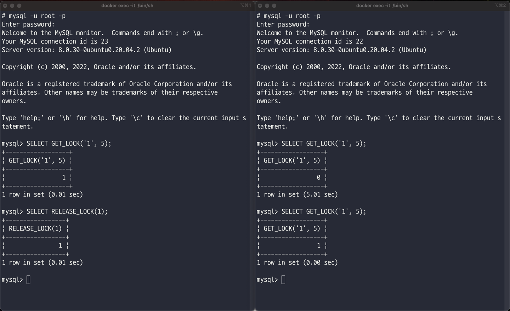
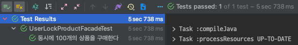
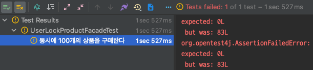

# concurrency-named-lock

## 네임드 락

네임드 락은 `GET_LOCK()` 함수를 활용하여 임의의 문자열에 대한 잠금을 설정할 수 있다. 단순히 사용자가 지정한 문자열에 대한 락을 획득하고 반납한다.

## GET_LOCK(str, timeout)

문자열(str)에 해당하는 락을 획득한다.

* `return 1`: 락 획득에 성공했다.
* `return 0`: timeout 동안 락을 획득하지 못했다.

```sql
mysql
>
SELECT GET_LOCK('1', 5);
+------------------+
| GET_LOCK('1', 5) |
+------------------+
|                1 |
+------------------+
```

먼저 터미널에 접속하여 두 개의 세션을 생성한다. 터미널(1)에는 `GET_LOCK()`을 통해 락을 획득한다. 터미널(2)도 동일하게 수행한다.


결과적으로 `1`은 현재 네임드 락을 설정했기 때문에 터미널(2)에서는 락 획득이 불가능하여 timeout 이후 0을 반환한다. 즉 락을 획득하지 못했음을 의미한다.

## RELEASE_LOCK(str)

문자열(str)에 해당하는 락을 해제한다.

* `return 1`: 락을 해제한다.
* `return null`: 해제할 락이 존재하지 않는다.



락을 진행한 터미널(1)에서 `RELEASE_LOCK()`을 통해 해제하면 터미널(2)에서 `1` 락을 획득할 수 있다. 락 해제는 오직 `락을 획득한 세션에서만 가능`하다는 것을 염두해두어야 한다.

## 네임드 락 적용

네임드 락은 별도의 `DataSource`를 연동하여 `Lock`을 지정하는 것이 바람직하다. 만약 데이터가 담긴 `DataSource`를 공유해서 사용할 경우 락을 걸기 위해 별도의 커넥션이 필요하며 점유하는
시간이 길어지면 한정된 자원인 커넥션 풀 부족으로 문제가 발생할 수 있다.

먼저 일반적인 데이터 저장을 위한 `DataSource` 설정과 락 관련 `DataSource` 정보를 명시한다.

```yaml
spring:
  # ...
  datasource:
    driver-class-name: com.mysql.cj.jdbc.Driver
    jdbc-url: jdbc:mysql://127.0.0.1:3306/products
    username: root
    password: root

user-lock:
  datasource:
    driver-class-name: com.mysql.cj.jdbc.Driver
    jdbc-url: jdbc:mysql://127.0.0.1:3307/user_lock
    username: root
    password: root
# ...
```

`spring.datasource`는 기본적으로 사용되는 데이터베이스 정보를 설정한다. `user-lock.datasource`에는 네임드 락을 사용하기 위한 `DataSource`를 설정한다. 별도로 설정 정보를
관리하면 각각 커넥션 풀의 개수를 관리할 수 있다.

이제 설정 정보를 기반으로 `DataSource`를 `Bean`으로 등록한다.

```java

@Configuration
public class DataSourceConfig {

    @Bean
    @Primary
    @ConfigurationProperties("spring.datasource")
    public DataSource dataSource() {
        return DataSourceBuilder.create()
                .build();
    }

    @Bean
    @ConfigurationProperties("user-lock.datasource")
    public DataSource lockDataSource() {
        return DataSourceBuilder.create()
                .build();
    }
}
```

주 사용될 `DataSource`는 `@Primary` 애노테이션을 활용한다. 아래는 락 관련된 데이터베이스 접근을 위한 `lockDataSource`이다.

이제 복잡한 코드가 다수 등장할 예정이다. 앞서 언급한 것 처럼 락을 획득과 제거는 같은 세션에서 이루어져야 한다. 즉 같은 커넥션 내부에서 일어나야 하는 일련의 과정이다. 트랜잭션을 활용하면 빠르게 대응이
가능 하겠지만 `DataSource`가 두개 이므로 데이터 조작을 위한 로직과 락 관련 로직은 별도의 트랜잭션으로 분리해야 한다.

먼저 비즈니스 로직이 담긴 `ProductService`이다.

```java

@Service
public class ProductService {

    private final ProductRepository productRepository;

    public ProductService(final ProductRepository productRepository) {
        this.productRepository = productRepository;
    }

    @Transactional
    public void purchase(final Long id, final Long quantity) {
        var foundProduct = getProduct(id);
        foundProduct.decrease(quantity);
    }

    private Product getProduct(final Long id) {
        return productRepository.findById(id)
                .orElseThrow(NoSuchElementException::new);
    }
}
```

이전 시간에 다룬 `Service`와 거의 유사하다. `@Transactional`은 우리가 `@Primary` 빈으로 등록한 DataSource로 설정한 커넥션을 획득할 것이다. 이제 락 관련 로직을 추가하자.

`UserLockProductFacade`는 락 관련 기능이 추가된 `Facade`이다. `UserLockTemplate`의 `executeWithLockWithoutResult()`를 통해 락 설정 정보와 행위를
전달하고 있다. 이제 `executeWithLockWithoutResult()` 내부를 살펴보자.

```java

@Component
public class UserLockTemplate {

    private static final String GET_LOCK = "SELECT GET_LOCK(?, ?)";
    private static final String RELEASE_LOCK = "SELECT RELEASE_LOCK(?, ?)";

    private final DataSource dataSource;

    public UserLockTemplate(@Qualifier("lockDataSource") final DataSource dataSource) {
        this.dataSource = dataSource;
    }

    public void executeWithLockWithoutResult(final String userLockName, double timeout, final Executor callback) {
        executeWithLock(userLockName, timeout, () -> {
            callback.execute();
            return null;
        });
    }

    public <T> T executeWithLock(final String userLockName, double timeout, final Supplier<T> supplier) {
        try (var connection = dataSource.getConnection()) {
            return execute(connection, userLockName, timeout, supplier);
        } catch (SQLException e) {
            throw new RuntimeException(e);
        }
    }

    private <T> T execute(final Connection connection, final String userLockName, final double timeout,
                          final Supplier<T> supplier) {
        try {
            getLock(connection, userLockName, timeout);
            return supplier.get();
        } finally {
            releaseLock(connection, userLockName);
        }
    }

    private void getLock(final Connection connection, final String userLockName, double timeout) {
        try (var preparedStatement = connection.prepareStatement(GET_LOCK)) {
            preparedStatement.setString(1, userLockName);
            preparedStatement.setDouble(2, timeout);
            preparedStatement.executeQuery();
        } catch (final SQLException e) {
            throw new RuntimeException(e);
        }
    }

    private void releaseLock(final Connection connection, final String userLockName) {
        try (var preparedStatement = connection.prepareStatement(RELEASE_LOCK)) {
            preparedStatement.setString(1, userLockName);
            preparedStatement.executeQuery();
        } catch (final SQLException e) {
            throw new RuntimeException(e);
        }
    }
}
```

`UserLockTemplate`은 락과 함께 행위를 수행하기 위한 객체이다. `TransactionTemplate`과 유사한 방법으로 구현 해보았다.

* `@Qualifier("lockDataSource") final DataSource dataSource`: `@Primary`로 선택한 dataSource가 아닌 `lockDataSource`를 주입 받는다.
* `executeWithLock()`: 락 기능과 함께 수행하기 위한 메서드이다. connection 객체를 안전하게 닫기 위한 책임을 가지고 있다.
* `execute()`: 전달된 행위를 실질적으로 락과 함께 수행하기 위한 메서드이다. 핵심은 `finally`에 락 반납 메서드를 위치 시켜 무조건 반납함을 보장한다.
* `executeWithLockWithoutResult()`: 반환이 필요하지 않는 행위를 전달할 때 사용하는 편의 메서드이다.
* `getLock()`: 락을 획득한다.
* `releaseLock()`: 락을 반납한다.

사용 방법은 간단하다. 락을 지정하고 싶은 행위를 전달하기만 하면 된다.

```java

@Component
public class UserLockProductFacade {

    private final UserLockTemplate userLockTemplate;
    private final ProductService productService;

    public UserLockProductFacade(final UserLockTemplate userLockTemplate, final ProductService productService) {
        this.userLockTemplate = userLockTemplate;
        this.productService = productService;
    }

    public void purchase(final Long id, final Long quantity) {
        userLockTemplate.executeWithLockWithoutResult(generateUserLockName(id), 5, () -> {
            productService.purchase(id, quantity);
        });
    }

    private String userLockNameGenerate(final Long id) {
        return id.toString();
    }
}
```

네임드 락의 이름은 `id`를 활용 했고, `timeout`은 `5초`를 지정했다.

이제 테스트를 수행해보자! 테스트 코드는 이전과 거의 유사하다.

```java

@SpringBootTest
@DisplayNameGeneration(ReplaceUnderscores.class)
class UserLockProductFacadeTest {

    private final ProductRepository productRepository;
    private final UserLockProductFacade userLockProductFacade;

    @Autowired
    UserLockProductFacadeTest(final ProductRepository productRepository,
                              final UserLockProductFacade userLockProductFacade) {
        this.productRepository = productRepository;
        this.userLockProductFacade = userLockProductFacade;
    }

    @Test
    void 동시에_100개의_상품을_구매한다() throws InterruptedException {
        var product = productRepository.save(new Product("치킨", 100L));

        var executorService = Executors.newFixedThreadPool(10);
        var countDownLatch = new CountDownLatch(100);
        for (int i = 0; i < 100; i++) {
            executorService.submit(() -> process(product, countDownLatch));
        }

        countDownLatch.await();

        var actual = productRepository.findById(product.getId()).orElseThrow();

        assertThat(actual.getQuantity()).isEqualTo(0L);
    }

    private void process(final Product product, final CountDownLatch countDownLatch) {
        try {
            userLockProductFacade.purchase(product.getId(), 1L);
        } finally {
            countDownLatch.countDown();
        }
    }
}
```



테스트는 정상적으로 수행된다!

## 남은 문제들

다만 한 가지 문제가 남아있다. 지금은 락을 획득하기 위한 대기 시간이 최대 5초이다. 만약 5초 이상이 걸리는 로직이라면 가차 없이 락을 획득하지 못하고 예외를 던질 것이다.

간단한 확인을 위해 락 대기 시간을 `0.1`초로 조정해본 뒤 테스트를 진행해본다.

```java

@Component
public class UserLockProductFacade {
    // ...
    public void purchase(final Long id, final Long quantity) {
        userLockTemplate.executeWithLockWithoutResult(generateUserLockName(id), 0.1, () -> {
            productService.purchase(id, quantity);
        });
    }
    // ...
}
```



아쉽게 테스트가 실패한다. 락 획득을 위한 대기 시간을 충분히 설정해주는 것이 좋아 보인다.

## 정리

지금 까지 네임드 락을 활용한 동시성 이슈를 해결하였다. 네임드 락도 `분산락`의 일종이다. 분산락의 정의 자체가 데이터베이스와 같은 공통된 저장소를 통해 자원이 사용 중인지 여부를 확인하는 것이기 때문이다.

다만 별도의 `DataSource`로 구성할 경우 개발자가 추가적으로 설정해줘야 하는 로직이 너무 많다. 또한 락 획득에 실패 했을 때에 대한 로직도 고려해야 한다. 또 다른 단점으로는 데이터베이스에 접근을 하다보니
메모리 저장소에 비해 느린 속도를 가질 것이다. 또한 특정 데이터베이스에 종속적인 구조가 나올 수 밖에 없다. 유연하게 사용하기 위해서는 개발자가 추가적으로 추상화 과정을 거쳐야 할 것 같다.

단점만 나열한 것 같지만 MySQL에 대한 지식이 충분하다면 고려 해볼만 하다. 결국 분산락이기 때문에 다중 애플리케이션 서버에 대응이 가능해진다. 

이번 과정을 통해서 애매하게 알고 있던 네임드 락에 대한 지식과 활용 방법을 습득할 수 있었다. 다음 시간에는 redis를 활용한 분산락에 대해 알아보려 한다.

## References.

[MySQL을 이용한 분산락으로 여러 서버에 걸친 동시성 관리](https://techblog.woowahan.com/2631/) <br>
[재고시스템으로 알아보는 동시성이슈 해결방법](https://www.inflearn.com/course/%EB%8F%99%EC%8B%9C%EC%84%B1%EC%9D%B4%EC%8A%88-%EC%9E%AC%EA%B3%A0%EC%8B%9C%EC%8A%A4%ED%85%9C)

