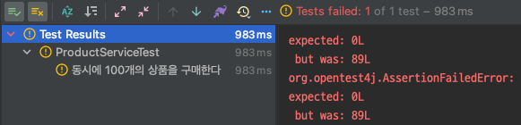
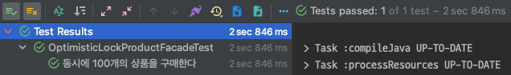

# concurrency-optimistic-lock

낙관적 락이란 트랜잭션 충돌이 발생하지 않는다고 낙관적으로 가정한다. 추가적인 `version`을 기반으로 충돌할 경우 롤백을 진행한다. 가장 큰 장점은 충돌이 일어나지 않는다고 가정하기 때문에 동시 처리에 대한
이점이 많다.

## @Version

낙관적 락을 사용하는 방법은 여러가지가 있지만 대표적으로는 `@Version` 애노테이션을 사용하는 방법이다. `@Version`은 낙관적 락 값으로 사용되는 엔터티 클래스의 버전 필드 또는 속성을 지정한다. 이
버전은 병합 작업을 수행할 때 무결성을 보장하고 낙관적 동시성 제어를 위해 사용 된다. `@Version`은 클래스당 하나의 속성 또는 필드만 사용해야 한다. 둘 이상의 버전 또는 속성 필드를 사용할 수 없다.

`@Version`은 엔티티 클래스의 기본 테이블에 매핑되어야 한다. 기본 테이블이 아닌 다른 테이블에 매핑할 수 없다. `@Version`이 지원되는 type은 `int`, `Integer`, `short`
, `long`, `Long`, `java.sql.Timestamp`이다. `@Version`이 사용된 엔티티는 `수정`될 때 자동으로 버전이 증가하며 수정할 때 조회 시점과 버전이 다른 경우 예외가 발생한다.

이러한 버전은 엔티티 수정 시점에 최신화되며 JPA에 의해 자동적으로 관리된다.

```sql
update product
set name     = ?,
    quantity = ?,
    version  = ?
where id = ?
  and version = ?
```

## 낙관적 락 적용

예제는 마찬가지로 이전에 작성한 Product 엔티티를 활용한다. 먼저 `@Version`이라는 애노테이션을 활용하여 version 관련 칼럼을 추가한다.

```java

@Entity
public class Product {

    @Id
    @GeneratedValue(strategy = GenerationType.IDENTITY)
    private Long id;

    @Column(name = "name")
    private String name;

    @Column(name = "quantity")
    private Long quantity;

    @Version
    private Long version;

    // ...
}
```

`version`이라는 칼럼이 추가적으로 생성되어 테이블이 생성된다. 이러한 Version 정보를 사용하면 최초에 적용된 커밋만 반영되고 나머지는 무시된다.

```sql
create table product
(
    id       bigint not null auto_increment,
    name     varchar(255),
    quantity bigint,
    version  bigint,
    primary key (id)
) 
```

아래는 구매와 관련된 비즈니스 로직이 담긴 `ProductService`이다. 이전 코드와 대부분 유사하다.

```java

@Service
public class ProductService {

    private final ProductRepository productRepository;

    public ProductService(final ProductRepository productRepository) {
        this.productRepository = productRepository;
    }

    @Transactional
    public void purchase(final Long id, final Long quantity) {
        var foundProduct = getProduct(id);
        foundProduct.decrease(quantity);
    }

    private Product getProduct(final Long id) {
        return productRepository.findByIdWithOptimisticLock(id)
                .orElseThrow(NoSuchElementException::new);
    }
}
```

이제 동시성 테스트를 진행한다.

```java

@SpringBootTest
@DisplayNameGeneration(ReplaceUnderscores.class)
class ProductServiceTest {

    private final ProductRepository productRepository;
    private final ProductService productService;

    @Autowired
    ProductServiceTest(final ProductRepository productRepository,
                       final ProductService productService) {
        this.productRepository = productRepository;
        this.productService = productService;
    }

    @Test
    void 동시에_100개의_상품을_구매한다() throws InterruptedException {
        var product = productRepository.save(new Product("치킨", 100L));

        var executorService = Executors.newFixedThreadPool(10);
        var countDownLatch = new CountDownLatch(100);
        for (int i = 0; i < 100; i++) {
            executorService.submit(() -> process(product, countDownLatch));
        }

        countDownLatch.await();

        var actual = productRepository.findById(product.getId()).orElseThrow();

        assertThat(actual.getQuantity()).isEqualTo(0L);
    }
}
```



안타깝게도 낙관적 락은 WHERE 조건에 의해 수정할 대상이 없는 경우 버전이 증가 했다고 판단하여 예외를 던진다.

Spring Data JPA를 사용할 경우 JPA에 대한 구현체는 기본적으로 hibernate를 사용하게 된다. 이 예외는 기본적으로 hibernate에서 던지는 `StaleStateException` 예외를
Spring의 `HibernateJpaDialect`의 `convertHibernateAccessException()` 메서드를 통해 `org.springframework.dao` 계층에서 적절한 예외(
DataAccessException 타입)로 변환된다.

```java
package org.springframework.orm.jpa.vendor;

// ...
public class HibernateJpaDialect extends DefaultJpaDialect {
    // ...
    protected DataAccessException convertHibernateAccessException(HibernateException ex) {
        // ...
        if (ex instanceof StaleStateException) {
            return new ObjectOptimisticLockingFailureException(ex.getMessage(), ex);
        }
        // ...
    }
}
```

결국 낙관적 락은 실패 시 예외를 던지기 때문에 요구사항에 따라 `재시도 하는 로직`이 필요할 수 있다. 가장 간단한 방법은 충돌이 일어난 시점에 던지는 예외를 캐치하여 다시 로직 처리를 위한 요청을 보내는 것이다.

```java

@Component
public class OptimisticLockProductFacade {

    private final ProductService productService;

    public OptimisticLockProductFacade(final ProductService productService) {
        this.productService = productService;
    }

    public void purchase(final Long id, final Long quantity) throws InterruptedException {
        while (true) {
            try {
                productService.purchase(id, quantity);
                break;
            } catch (final ObjectOptimisticLockingFailureException e) {
                Thread.sleep(100);
            }
        }
    }
}
```

구조는 매우 간단하다. 무한 루프를 돌며 계속 구매를 진행하면 된다. 낙관적 락 관련 예외가 발생했을 때는 잠깐의 쉬는 시간 이후 다시 요청을 진행한다. 다시 테스트를 진행해보자.



성공적으로 통과하는 것을 확인할 수 있다.

## 추후 알아볼 것

```java
public interface ProductRepository extends JpaRepository<Product, Long> {

    @Lock(LockModeType.OPTIMISTIC)
    @Query("SELECT p FROM Product p WHERE p.id = :id")
    Optional<Product> findByIdWithOptimisticLock(final Long id);
}
```

위와 같이 `@Lock(LockModeType.OPTIMISTIC)`을 사용하여 조회 쿼리에 낙관적 락을 명시하면 아래와 같이 version을 검증하기 위한 SELECT 쿼리가 추가된다.

```sql
select version as version_
from product
where id = ?
```

이 쿼리의 용도는 무엇일까? 공식 문서에 따르면 버전이 지정된 객체에 대해 `@Lock(LockModeType.OPTIMISTIC)` 유형의 잠금을 호출하는 경우 `Drity Read`
와 `Non-repeatable read`가 발생하지 않도록 조심해야 한다고 언급되어 있다. 이 부분에 대해 아직 명확하기 이해가 되지 않아 뚜렷한 적용 사례가 떠오르지 않는다.

## 정리

낙관적 락은 `@Version`이라는 애노테이션으로 손쉽게 적용이 가능하다. 또한 데이터베이스에 직접 락을 거는 것이 아니기 때문에 성능 상에 이점이 많다.

하지만 UPDATE가 실패 했을 때 요구사항에 맞는 재시도 로직을 직접 작성해야 한다. 만약 충돌이 빈번하게 일어나는 경우에는 낙관적 락은 좋은 해결책이 아닐 수 있다.

다음 시간에는 추가적인 `DataSource`를 활용하여 별도의 공간에 락을 관리하는 `Named Lock`을 통해 동시성 이슈를 해결해보려 한다.

## References.

[재고시스템으로 알아보는 동시성이슈 해결방법](https://www.inflearn.com/course/%EB%8F%99%EC%8B%9C%EC%84%B1%EC%9D%B4%EC%8A%88-%EC%9E%AC%EA%B3%A0%EC%8B%9C%EC%8A%A4%ED%85%9C)
