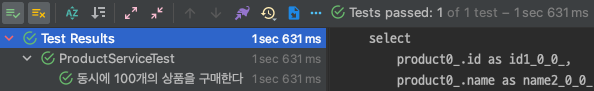

# concurrency-pessimistic-lock

## 비관적 락

비관적 락이란, 트랜잭션 사이에 충돌이 발생할 것임을 `비관적`으로 가정한 뒤 락을 거는 방식을 말한다. 데이터베이스에서 제공하는 락 기능을 활용한다.

특정 트랜잭션에서 `x-lock`을 획득하게 되면 다른 트랜잭션에서는 락이 해제될 때 까지 대기하게 된다.

## 예제 코드

예제 코드는 이전에 `synchronized`를 활용한 동시성 이슈 해결에서 사용한 Product 엔티티를 재사용할 것이다. 추가된 부분은 `x-lock`을 건 뒤 조회하는 메서드가 추가 되었다.

MySQL은 가장 최신 버전인 `8.0.30`을 활용 했으며 기본 스토리지 엔진인 `InnoDB`를 사용 했다.

## 비관적 락 적용

비관적 락 적용은 `@Lock` 애노테이션을 통해 쉽게 적용이 가능하다.

```java
public interface ProductRepository extends JpaRepository<Product, Long> {

    @Lock(value = LockModeType.PESSIMISTIC_WRITE)
    @Query("SELECT p FROM Product p WHERE p.id = :id")
    Optional<Product> findByIdWithPessimisticLock(final Long id);
}
```

`@Lock(value = LockModeType.PESSIMISTIC_WRITE)`을 적용한 뒤 위 메서드를 수행하면 아래와 같은 쿼리를 확인할 수 있다.

```sql
select product0_.id       as id1_0_,
       product0_.name     as name2_0_,
       product0_.quantity as quantity3_0_
from product product0_
where product0_.id = ? for update
```

`for update`란 키워드가 추가된 것을 확인할 수 있다. 이것이 의미하는 바는 조회하는 데이터를 수정하기 위해 `x-lock`을 걸었다는 의미이다. 다른 트랜잭션에서는 해제될 때 까지 기다리게 된다.

아래 테스트 코드를 수행해보면 정상적으로 통과하는 것을 확인할 수 있다.

```java

@SpringBootTest
@DisplayNameGeneration(ReplaceUnderscores.class)
class ProductServiceTest {
    // ...
    @Test
    void 동시에_100개의_상품을_구매한다() throws InterruptedException {
        var product = productRepository.save(new Product("치킨", 100L));

        var executorService = Executors.newFixedThreadPool(10);
        var countDownLatch = new CountDownLatch(100);
        for (int i = 0; i < 100; i++) {
            executorService.submit(() -> process(product, countDownLatch));
        }

        countDownLatch.await();

        var actual = productRepository.findById(product.getId()).orElseThrow();

        assertThat(actual.getQuantity()).isEqualTo(0L);
    }

    private void process(final Product product, final CountDownLatch countDownLatch) {
        try {
            productService.purchase(product.getId(), 1L);
        } finally {
            countDownLatch.countDown();
        }
    }
}
```



이 방식에 가장 큰 장점은 충돌이 빈번하게 일어나는 상황에서 데이터의 정합성을 적절하게 지킬 수 있다는 것이다. 단점으로는 실제 데이터베이스에 락을 걸기 때문에 다수의 요청에 유연하게 대응하지 못한다.

## @Lock

`@Lock` 애노테이션은 트랜잭션 범위 내에서만 유효하다. 비관적 락을 걸기 위한 `LockModeType`은 3 가지가 존재한다.

* `PESSIMISTIC_READ`: `s-lock`을 건다.
* `PESSIMISTIC_WRITE`: `x-lock`을 건다. 앞서 동시성 이슈 해결을 위해 적용한 `LockModeType`이다.
* `PESSIMISTIC_FORCE_INCREMENT`: 버전 업데이트와 함께 `x-lock`을 수행한다. version 칼럼이 추가적으로 필요한 것으로 판단되는데 자세한 사용 예시는 아직 떠오르지 않는다.

`@Lock(value = LockModeType.PESSIMISTIC_READ)`, `s-lock`을 활용할 경우 아래와 같은 쿼리를 확인할 수 있다.

```sql
select product0_.id       as id1_0_,
       product0_.name     as name2_0_,
       product0_.quantity as quantity3_0_
from product product0_
where product0_.id = ? for share
```

`for share`는 `s-lock`으로, 트랜잭션이 끝날 때 까지 조회한 레코드가 변경되지 않는 것을 보장한다. 해당 레코드를 수정하려는 다른 트랜잭션은 락이 해제될 때 까지 대기하게 된다. 다만 `s-lock`
이기 때문에 여러 트랜잭션에서 `조회`는 가능하다.

이러한 특성 때문에 `교착상태(deadlock)`에 빠질 가능성이 높다. 관련 사례는
[15.7.5.1 An InnoDB Deadlock Example](https://dev.mysql.com/doc/refman/8.0/en/innodb-deadlock-example.html)에 잘 설명되어 있다.

간단한 예시를 들어보면 두 트랜잭션이 동시에 `s-lock`을 통해 레코드를 조회 했다고 가정한다. 두 트랜잭션은 조회된 레코드를 `UPDATE`한다. `UPDATE`나 `DELETE`를 위해서는 `x-lock`이
필요하다. 두 트랜잭션은 서로 `x-lock`을 획득하기 위해 `s-lock`이 해제될 때 까지 기다린다. 결국 두 트랜잭션 모두 `x-lock`을 획득하지 못한 채 `deadlock`이 발생한다.

그림으로 표현하면 아래와 같다.


조회 메서드를 `@Lock(value = LockModeType.PESSIMISTIC_READ)`으로 수정한 뒤 테스트를 수행하면 `ERROR log`와 함께 테스트가 실패한다.

```java
public interface ProductRepository extends JpaRepository<Product, Long> {

    @Lock(value = LockModeType.PESSIMISTIC_READ)
    @Query("SELECT p FROM Product p WHERE p.id = :id")
    Optional<Product> findByIdWithPessimisticLock(final Long id);
}
```

```shell
2022-12-12 15:56:50.399  WARN 96139 --- [ool-1-thread-10] o.h.engine.jdbc.spi.SqlExceptionHelper   : SQL Error: 1213, SQLState: 40001
2022-12-12 15:56:50.402 ERROR 96139 --- [pool-1-thread-2] o.h.engine.jdbc.spi.SqlExceptionHelper   : Deadlock found when trying to get lock; try restarting transaction
```


## [번외] 조회 없이 바로 UPDATE

예제를 작성하던 중 복잡하지 않은 비즈니스 로직인데 `for update`를 통해 조회하지 않고 바로 `UPDATE`를 진행해도 되지 않을까라는 의문이 생겼다. 가령 아래와 같이 말이다.

```java
public interface ProductRepository extends JpaRepository<Product, Long> {

    @Modifying
    @Query("UPDATE Product p "
            + "SET p.quantity = p.quantity - :quantity "
            + "WHERE p.id = :id")
    void decreaseQuantity(final Long quantity, final Long id);
}
```

```java

@Service
public class ProductService {
    // ...
    @Transactional
    public void purchase(final Long id, final Long quantity) {
        productRepository.decreaseQuantity(quantity, id);
    }
}
```

쿼리를 살펴보면 아래와 같다.

```sql
update product
set quantity = quantity - ?
where id = ?
```

실제 테스트를 수행해도 통과한다.


다만 무조건 요청이 100번만 온다는 보장이 없기 때문에 수량 보다 많은 요청이 들어온다고 가정한 뒤 테스트를 진행했다.


쿼리에 수량에 대한 조건이 없기 때문에 우리가 요구사항이 만족하지 않는다. 이때 쿼리에 수량에 대한 조건을 추가한다.

```java
public interface ProductRepository extends JpaRepository<Product, Long> {

    @Modifying
    @Query("UPDATE Product p "
            + "SET p.quantity = p.quantity - :quantity "
            + "WHERE p.id = :id AND p.quantity > 0")
    void decreaseQuantity(final Long quantity, final Long id);
}
```

위 쿼리는 한 번에 요구사항 처리가 가능하지만 데이터베이스에 굉장히 종속적인 방법이라고 할 수 있다. 기존 방법인 `x-lock`을 통한 조회 이후 `UPDATE`를 수행할 경우 애플리케이션 레벨에서 제약 조건을
확인할 수 있다는 장점이 있다. 각 상황에 맞춰서 적절한 방법을 선택하면 좋을 것 같다.

## 정리

지금까지 비관적 락을 활용한 동시성 이슈 해결 방법에 대해 알아보았다. 비관적 락은 공유 자원인 데이터베이스에 락을 걸어 하나의 트랜잭션만 처리할 수 있도록 상호배제를 달성한다. 다중 애플리케이션 서버와 단일
데이터베이스의 경우 이러한 방식은 동시성 이슈에 대한 빠른 해결책이 될 수 있다.

하지만 데이터베이스에 직접 락을 걸기 때문에 락이 걸린 자원에 접근하는 트랜잭션은 대기하게 된다. 트랜잭션이 늘어날수록 대기하는 시간을 길어질 것이다. 즉 성능 상에 문제가 생길 수 있다.

다음 시간에는 데이터베이스에 직접 락을 걸지 않고 version이라는 추가적인 칼럼을 통해 동시성 이슈를 해결하는 방법에 대해 알아볼 예정이다.

## References.

[15.7.5.1 An InnoDB Deadlock Example](https://dev.mysql.com/doc/refman/8.0/en/innodb-deadlock-example.html)<br>
[재고시스템으로 알아보는 동시성이슈 해결방법](https://www.inflearn.com/course/%EB%8F%99%EC%8B%9C%EC%84%B1%EC%9D%B4%EC%8A%88-%EC%9E%AC%EA%B3%A0%EC%8B%9C%EC%8A%A4%ED%85%9C)

