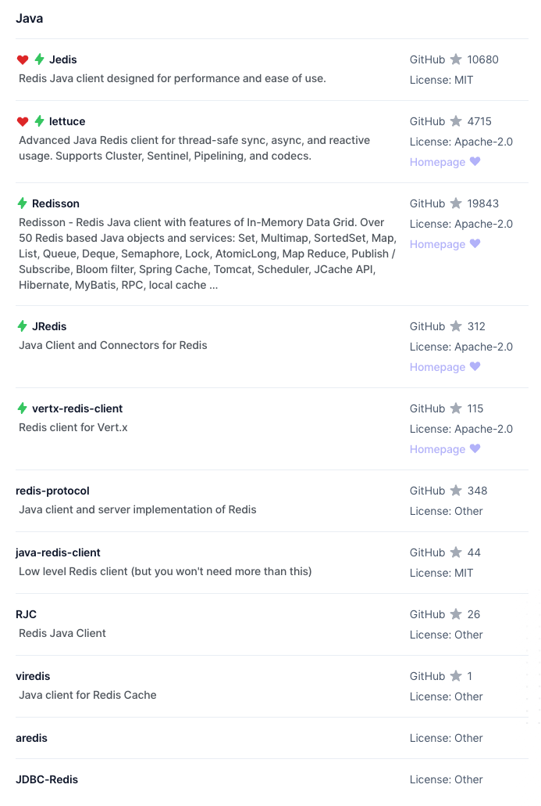
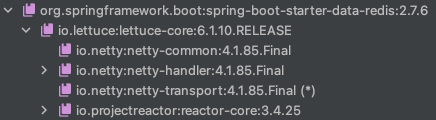
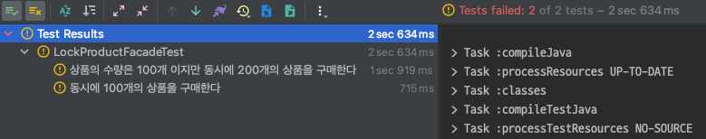
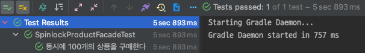

# concurrency-spinlock

## 스핀락

이번 시간에는 `Redis`를 활용한 스핀락 방식으로 동시성 이슈를 해결해보려 한다. 스핀락은 `Redis`의 `SETNX` 명령어를 통해 `분산락`을 구현할 수 있다.

`SETNX`는 `SET` if `N`ot e`X`ists의 준말이다. 키가 없는 문자열 값을 유지하도록 키를 설정한다. 이 경우에는 `SET`과 동일하다. 차이점은 키가 이미 값을 보유하고 있는 경우 작업이
수행되지 않는다. 즉 이것을 통해 분산락을 구현할 수 있다.

```shell
# redis-cli
127.0.0.1:6379> SETNX 1 lock
(integer) 1 // 락 획득
127.0.0.1:6379> SETNX 1 lock
(integer) 0 // 락 획득 실패
```

> `SET`은 가장 기본적인 데이터 입력 형태로 키와 값을 입력한다. 만약 키가 이미 지정되어 있다면 덮어씌워 진다.

레디스를 활용 했을 때의 가장 큰 장점은 디스크에 접근하는 것이 아니라 메모리에 접근하는 것 이기 때문에 더 빠르게 락을 획득하고 해제할 수 있다.

## Redis 의존성

다른 프로그래밍 언어에서 레디스 프로토콜 사용을 위해서는 레디스 클라이언트를 사용해야 한다. Java에는 대표적으로 `Jedis`, `lettuce`, `Redisson` 등이 존재한다.



먼저 스프링에서 레디스 사용을 위해서는 의존성을 추가해야 한다.

```groovy
dependencies {
    // ...
    implementation 'org.springframework.boot:spring-boot-starter-data-redis'
    // ...
}
```

대규모 Spring Data 제품군의 일부인 `Spring Data Redis`는 스프링 애플리케이션에서 쉽게 구성하고 레디스에 접근할 수 있도록 지원한다. 이것은 저장소와 상화 작용하기 위해 낮은 수준과 높은
수준의 추상화를 모두 제공하고 있다. 위 의존성을 추가하면 레디스 클라이언트가 기본적으로 `lettuce`에 대한 의존성이 추가된다.



`Lettuce`는 동기식, 비동기식 및 reactive 사용을 위한 확장 가능한 스레드 안전한 레디스 클라이언트이다.

## RedisTemplate

레디스 데이터 접근 코드를 단순화하도록 도와주는 클래스이다. 레디스 저장소에서 지정된 객체와 기본 이진 데이터 간에 자동 직렬화/역직렬화를 수행한다.
기본적으로 `JdkSerializationRedisSerializer`을 통해 객체에 Java 직렬화를 사용한다. 문자열 집중 작업의 경우 전용 `StringRedisTemplate`를 고려할 수 있다.

`RedisTemplate`은 레디스가 제공하는 다양한 데이터 구조를 지원하기 위해 `opsForXXX()`와 같은 형태의 메서드가 존재한다.

사용하고자 하는 `redis command`에 대응하는 메서드를 호출하면 `operation` 객체가 반환된다.

```
ValueOperations<String, String> valueOperations = redisTemplate.opsForValue();
```

* `opsForValue()`: `ValueOperations`
* `opsForHash()`: `HashOperations`
* `opsForList()`: `ListOperations`
* `opsForSet()`: `SetOperations`
* `opsForZSet()`: `ZSetOperations`
* `opsForStream()`: `StreamOperations`
* `opsForGeo()`: `GeoOperations`
* `opsForHyperLogLog()`: `HyperLogLogOperations`
* `opsForCluster()`: `ClusterOperations`

분산락 구현을 위해서는 간단히 `문자열`을 활용할 수 있을 것이다. MySQL의 네임드 락과 동일하게 특정 문자열을 `SETNX`를 통해 락을 구현할 수 있다.

아래는 실제 락을 획득하고 해제하기 위한 `LockRepository`이다.

```java

@Component
public class RedisLockRepository {

    private final StringRedisTemplate redisTemplate;

    public RedisLockRepository(final StringRedisTemplate stringRedisTemplate) {
        this.redisTemplate = stringRedisTemplate;
    }

    public Boolean lock(final Long key) {
        return redisTemplate.opsForValue()
                .setIfAbsent(generateKey(key), "lock", Duration.ofMillis(3_000));
    }

    public Boolean unlock(final Long key) {
        return redisTemplate.delete(generateKey(key));
    }

    private String generateKey(final Long key) {
        return key.toString();
    }
}
```

* `StringRedisTemplate`: RedisTemplate의 문자열 중심의 클래스이다. 레디스에 대한 대부분의 작업은 문자열 기반이기 때문에 이 클래스는 특히 직렬화 변환기 측면에서 보다 일반적인 템플릿의
  구성을 최소화하는 전용 클래스를 제공한다.
* `lock()`: 락 획득을 위한 메서드이다. 락 획득에 성공하면 `true`, 실패하면 `false`를 반환한다.
* `opsForValue()`: 단순 값에 대해 수행된 작업을 반환한다.
* `setIfAbsent()`: 키가 없는 경우 문자열 value를 보유하도록 키를 설정한다. `SETNX` 명령어를 수행하는 것으로 판단된다. 특별한 조치가 없다면 레디스의 키는 삭제가 아닌 보관 처리된다.
  추측하기로는 timeout 시간을 지정하여 자동적으로 키를 제거하여 락이 오랜시간 잡히는 것을 막는 것으로 추측된다.
* `unlock()`: 락을 해제한다.

락을 획득한 뒤 로직을 수행하고 락을 해제하기 위한 `Facade`를 추가한다.

```java
@Component
public class LockProductFacade {

    private final RedisLockRepository redisLockRepository;
    private final ProductService productService;

    public LockProductFacade(final RedisLockRepository redisLockRepository,
                                 final ProductService productService) {
        this.redisLockRepository = redisLockRepository;
        this.productService = productService;
    }

    public void purchase(final Long key, final Long quantity) {
        try {
            redisLockRepository.lock(key);
            productService.purchase(key, quantity);
        } finally {
            redisLockRepository.unlock(key);
        }
    }
}
```

자 이제 테스트를 수행해보자.

```java
@SpringBootTest
@DisplayNameGeneration(ReplaceUnderscores.class)
class SpinlockProductFacadeTest {

    private final ProductRepository productRepository;
    private final SpinlockProductFacade spinlockProductFacade;

    @Autowired
    SpinlockProductFacadeTest(final ProductRepository productRepository,
                              final SpinlockProductFacade spinlockProductFacade) {
        this.productRepository = productRepository;
        this.spinlockProductFacade = spinlockProductFacade;
    }

    @Test
    void 동시에_100개의_상품을_구매한다() throws InterruptedException {
        var product = productRepository.save(new Product("치킨", 100L));

        var executorService = Executors.newFixedThreadPool(10);
        var countDownLatch = new CountDownLatch(100);
        for (int i = 0; i < 100; i++) {
            executorService.submit(() -> process(product, countDownLatch));
        }

        countDownLatch.await();

        var actual = productRepository.findById(product.getId()).orElseThrow();

        assertThat(actual.getQuantity()).isEqualTo(0L);
    }

    @Test
    void 상품의_수량은_100개_이지만_동시에_200개의_상품을_구매한다() throws InterruptedException {
        var product = productRepository.save(new Product("치킨", 100L));

        var executorService = Executors.newFixedThreadPool(10);
        var countDownLatch = new CountDownLatch(200);
        for (int i = 0; i < 200; i++) {
            executorService.submit(() -> process(product, countDownLatch));
        }

        countDownLatch.await();

        var actual = productRepository.findById(product.getId()).orElseThrow();

        assertThat(actual.getQuantity()).isEqualTo(0L);
    }

    private void process(final Product product, final CountDownLatch countDownLatch) {
        try {
            spinlockProductFacade.purchase(product.getId(), 1L);
        } catch (final InterruptedException e) {
            throw new RuntimeException(e);
        } finally {
            countDownLatch.countDown();
        }
    }
}
```



아쉽게도 실패한다. 위 방식을 활용하면 락 실패 시 추가적인 재시도 로직을 작성해야 한다. 보통은 특정 시간 이후 재요청을 할 수 있는 `스핀락 방식`을 활용할 수 있다.

## 스핀락 적용하기

```java
@Component
public class SpinlockProductFacade {

    private final RedisLockRepository redisLockRepository;
    private final ProductService productService;

    public SpinlockProductFacade(final RedisLockRepository redisLockRepository,
                                 final ProductService productService) {
        this.redisLockRepository = redisLockRepository;
        this.productService = productService;
    }

    public void purchase(final Long key, final Long quantity) throws InterruptedException {
        while (!redisLockRepository.lock(key)) {
            Thread.sleep(100);
        }

        try {
            productService.purchase(key, quantity);
        } finally {
            redisLockRepository.unlock(key);
        }
    }
}
```

로직은 간단한다. 스핀락을 통해 락이 획득가능한지 주기적으로 확인 후 로직을 수행한다. 로직이 정상적으로 수행되면 락을 해제해야 하기 때문에 `finally`로 락을 해제한다.

테스트를 수행하면 정상적으로 통과하는 것을 알 수 있다.



## 정리

지금 까지 레디스 클라이언트인 `lettuce`를 활용하여 동시성 이슈를 해결하였다. `lettuce`는 Spring Data Redis 의존성 추가 시 기본적으로 적용되기 때문에 간편하게 적용이 가능하지만 락 획득 및 반납 로직을 개발자가 직접 작성해야 한다.

또한 락 획득 실패 시 재시도를 위한 로직까지 구현해야 한다. 대표적으로는 스핀락을 활용하여 구현할 수 있다. 스핀락 방식으로도 충분히 동시성 이슈가 해결되지만 레디스 서버에 지속적인 요청을 보내기 때문에 부하가 올 수 있다.

다음 시간에는 `pub/sub` 방식을 기반으로 락을 구현하는 레디스 클라이언트 `Redisson`을 활용하여 동시성 이슈를 해결해보려 한다.

## References.

[SETNX](https://redis.io/commands/setnx)<br>
[setIfAbsent()](https://docs.spring.io/spring-data/redis/docs/current/api/org/springframework/data/redis/core/BoundValueOperations.html#setIfAbsent(V,java.time.Duration))<br>
[Redis client](https://redis.io/resources/clients/#java)<br>
[Lettuce - Advanced Java Redis client](https://github.com/lettuce-io/lettuce-core)<br>
[Spring Boot Data Redis 사용해보기](https://luvstudy.tistory.com/143)
