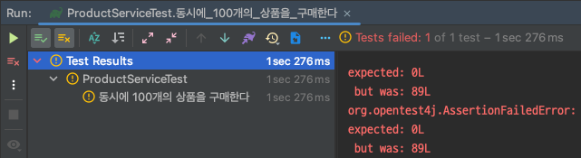
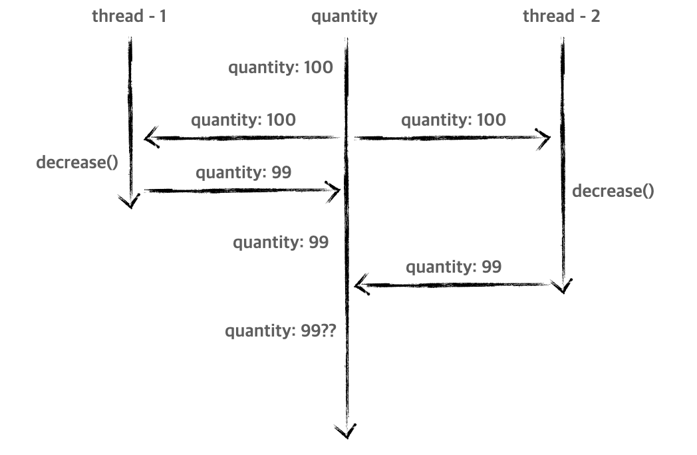
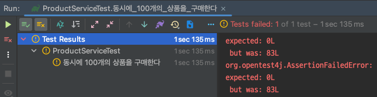
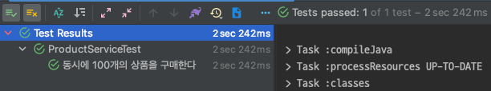

# concurrency-synchronized

서버 개발을 하다보면 여러 요청에서 동시에 공유 자원을 활용하는 경우 동시성 이슈가 발생할 수 있다. 특히 Java를 활용한 웹 애플리케이션의 경우 멀티 스레드로 동작하기 때문에 데이터 정합성을 위해서는 공유 자원에
대한 관리가 필요하다.

동시성 이슈 해결을 위해서는 다양한 방법이 존재한다. 요청 스레드가 순차적으로 처리할 수 있도록 제한하거나 비관적 락과 낙관적 락을 활용하거나 외부의 특정 저장소에 락에 대한 관리를 통해 공유 자원을 동시에 점유하지
못하게 하는 등 다양한 방법을 통해 막을 수 있다. 이번 시간에는 그 중에서도 애플리케이션 레벨에서 순차적으로 자원에 접근하여 동시성 이슈를 해결하는 방법에 대해 알아보려 한다.

## 예제 코드

먼저 이번 글에서 사용하는 예제 코드를 살펴보자. 아래는 특정 상품을 나타내기 위한 Product 엔티티이다. Product는 이름과 한정된 개수를 나타내는 `quantity`를 가지고 있다.

```java

@Entity
public class Product {

    @Id
    @GeneratedValue(strategy = GenerationType.IDENTITY)
    private Long id;

    @Column(name = "name")
    private Long name;

    @Column(name = "quantity")
    private Long quantity;

    protected Product() {
    }

    public Product(final Long name, final Long quantity) {
        this.name = name;
        this.quantity = quantity;
    }

    public void decrease(final Long quantity) {
        if (this.quantity - quantity < 0) {
            throw new RuntimeException("수량은 0개 미만이 될 수 없습니다.");
        }

        this.quantity -= quantity;
    }
    // getter...
}
```

`decrease()` 메서드를 통해 수량을 감소 시킬 수 있다.

Product 엔티티 조작을 위한 `ProductRepository`이다.

```java
public interface ProductRepository extends JpaRepository<Product, Long> {
}
```

이제 상품을 구매했다고 가정하고 수량을 감소 시키는 비즈니스 로직을 `ProductService`에 작성한다.

```java

@Service
public class ProductService {

    private final ProductRepository productRepository;

    public ProductService(final ProductRepository productRepository) {
        this.productRepository = productRepository;
    }

    @Transactional
    public void purchase(final Long id, final Long quantity) {
        var foundProduct = getProduct(id);
        foundProduct.decrease(quantity);
    }

    private Product getProduct(final Long id) {
        return productRepository.findById(id)
                .orElseThrow(NoSuchElementException::new);
    }
}
```

비교적 간단한 로직을 가지고 있다. 특정 id를 가진 Product를 조회하고 수량을 감소시킨다. 두 과정은 일련의 트랜잭션에서 이루어져야 하기 때문에 `@Transactional`을 활용한다.

준비는 끝났다. 이제 동시성 이슈를 발생시켜 문제를 확인해본다. 아래는 동시성 이슈 확인을 위한 테스트 코드이다.

```java

@SpringBootTest
@DisplayNameGeneration(ReplaceUnderscores.class)
class ProductServiceTest {
    // ...
    @Test
    void 동시에_100개의_상품을_구매한다() throws InterruptedException {
        var product = productRepository.save(new Product("치킨", 100L));

        var executorService = Executors.newFixedThreadPool(10);
        var countDownLatch = new CountDownLatch(100);
        for (int i = 0; i < 100; i++) {
            executorService.submit(() -> process(product, countDownLatch));
        }

        countDownLatch.await();

        var actual = productRepository.findById(product.getId()).orElseThrow();

        assertThat(actual.getQuantity()).isEqualTo(0L);
    }

    private void process(final Product product, final CountDownLatch countDownLatch) {
        try {
            productService.purchase(product.getId(), 1L);
        } finally {
            countDownLatch.countDown();
        }
    }
}
```

자세한 코드 설명은 생략한다. 핵심은 순간적으로 100개의 요청을 보낸 뒤 100개의 요청이 모두 끝날 때 까지 `await()`한다. 이후 수량을 조회한 뒤 몇 개의 상품이 판매되었는지 확인한다.

상품 100개를 구매하길 원했지만 불행하게도 위 테스트는 실패한다.



100개 중 고작 11개의 상품만 정상적으로 수량이 줄어든 것을 확인할 수 있다. 왜 이런 일이 발생하는 것일까?

## 문제 원인 분석

문제의 핵심은 `quantity`라는 `공유 자원`에 여러 요청, 즉 여러 스레드가 동시에 접근할 수 있다는 것이다. 순차적으로 접근하여 수량을 감소시키길 기대하지만 멀티 스레드 환경에서 의도적으로 동작하지 않을
것이다. 그림으로 표현하면 아래와 같다.



두개의 요청이 들어와 수량이 98로 감소하길 기대 했지만 자원에 동시 접근하는 시점에 같은 수량을 읽게 되므로 업데이트 하는 시점에 `갱신 손실`이 발생하게 된다.

## synchronized

이것은 Java의 `synchronized` 키워드를 통해 `임계 영역`을 설정하여 해결할 수 있다. `synchronized`를 활용하면 여러 스레드에서 공유 자원을 사용할 때 최초에 접근한 스레드를 제외하고
나머지 스레드는 접근할 수
없도록 제한할 수 있다. Java에서는 Monitor 도구를 통해 객체에 Lock을 걸어 `상호배제`를 할 수 있다. 자세한 내용은 상호배제 기법에 대해 알아보면 좋을 것 같다.

> 임계 영역이란, 멀티 스레드 환경에서 하나의 스레드만 실행할 수 있는 영역을 일컫는다.

핵심은 `synchronized`를 사용하면 오직 하나의 스레드에서만 `임계 영역`에 접근이 가능하다는 것이다. 적용하면 아래와 같다.

```java

@Service
public class ProductService {
    // ...
    @Transactional
    public synchronized void purchase(final Long id, final Long quantity) {
        var foundProduct = getProduct(id);
        foundProduct.decrease(quantity);
    }

    private Product getProduct(final Long id) {
        return productRepository.findById(id)
                .orElseThrow(NoSuchElementException::new);
    }
}
```

메서드 선언부에 `synchronized` 키워드를 추가한다. 해당 키워드를 통해 이 메서드를 가진 객체를 기준으로 동기화 과정을 진행한다. `ProductService` 같은 경우 기본적으로 싱글턴 방식으로
생성되기 때문에 해당 객체의 메서드는 한 번에 하나의 스레드만 접근할 수 있다고 이해하면 된다. 이 밖에도 `synchronized`를 어디에, 어떤 메서드에 명시하냐에 따라 다양하게 동작할 수 있다.

자 이제 모든 동시성 이슈는 해결되었을 것이다. 다시 한 번 위 테스트를 실행해보자.



아쉽게도 위 테스트는 실패한다. 분명 `synchronized`를 통해 임계 영역까지 설정했는데 왜 동시성 이슈가 발생할까?

## 문제 원인 다시 분석

문제의 원인은 `@Transactional`의 특수한 구조 때문이다. Spring은 기본적으로 프록시를 통해 부가기능인 트랜잭션을 구현한다. 간단한 pseudocode로 표현하면 아래와 같다.

```java
public class ProductServiceProxy {

    private final ProductService productService;

    // ...
    public void purchase(final Long id, Long quantity) {
        startTransaction(); // 1) 트랜잭션 시작

        stockService.purchase(id, quantity); // 2) 임계 영역 

        endTransaction(); // 3 트랜잭션 끝
    }
}
```

여러 스레드는 동시에 트랜잭션을 시작할 수 있다. 이후 임계 영역에 진입하면 순차적으로 `purchase()` 메서드를 수행할 것이다. 하지만 `purchase()`는 바로 데이터베이스에 반영되지 않는다. `3`에
접근했을 때 비로소 데이터베이스에 반영되기 때문이다. 결국 반영 이전에 임계 영역에 접근하는 스레드 때문에 `갱실 손실`이 동일하게 발생하는 것이다.

해결 방법은 트랜잭션의 범위보다 임계 영역의 범위를 더 넓게 가져가는 것이다. `ProductService`보다 상위 계층에서 임계 영역을 지정한 뒤 `purchase()`를 호출한다.

```java

@Component
public class SynchronizedProductService {

    private final ProductService productService;

    public SynchronizedProductService(final ProductService productService) {
        this.productService = productService;
    }

    public synchronized void purchase(final Long id, final Long quantity) {
        productService.purchase(id, quantity);
    }
}
```

> 상위 계층을 추가한 이유는 같은 객체 내에서 내부 호출을 진행할 경우 프록시 로직을 정상적으로 타지 않는 문제가 발생할 수 있다. 이에 대한 키워드로 트랜잭션 내부 호출에 대해 알아보면 좋을 것 같다.

테스트 코드도 수정한다.

```java

@SpringBootTest
@DisplayNameGeneration(ReplaceUnderscores.class)
class ProductServiceTest {
    // ...
    @Test
    void 동시에_100개의_상품을_구매한다() throws InterruptedException {
        var product = productRepository.save(new Product("치킨", 100L));

        var executorService = Executors.newFixedThreadPool(10);
        var countDownLatch = new CountDownLatch(100);
        for (int i = 0; i < 100; i++) {
            executorService.submit(() -> process(product, countDownLatch));
        }

        countDownLatch.await();

        var actual = productRepository.findById(product.getId()).orElseThrow();

        assertThat(actual.getQuantity()).isEqualTo(0L);
    }

    private void process(final Product product, final CountDownLatch countDownLatch) {
        try {
            synchronizedProductService.purchase(product.getId(), 1L);
        } finally {
            countDownLatch.countDown();
        }
    }
}
```



테스트가 정상적으로 수행되는 것을 확인할 수 있다.

## 정리

지금 까지 `synchronized` 키워드를 통해 동시성 이슈를 해결하는 방법에 대해 알아보았다. `synchronized`는 손쉽게 적용이 가능하지만 다중 애플리케이션 환경에서는 적합하지 않을 수 있다. 이것은
하나의 서버 내에서만 동시성 이슈를 막아주기 때문이다. 결국 다수의 서버에서 데이터베이스라는 공유 자원에 접근을 제어하는데는 적합하지 않은 방식이다.

만약 스케일 아웃을 진행하지 않고 하나의 서버에서 모든 요청을 처리하는 경우에는 `synchronized`는 좋은 대안이 될 수 있다. 다만 `@Transactional` 함께 사용할 때는 프록시 구조에 대해
염두해두고 적절히 적용해야 한다. 다음 시간에는 비관적 락을 통해 동시성 이슈를 해결하는 방법에 대해 알아보려 한다.

## References.

[🔒 Java 로 동기화를 해보자!](https://tecoble.techcourse.co.kr/post/2021-10-23-java-synchronize/)<br>
[재고시스템으로 알아보는 동시성이슈 해결방법](https://www.inflearn.com/course/%EB%8F%99%EC%8B%9C%EC%84%B1%EC%9D%B4%EC%8A%88-%EC%9E%AC%EA%B3%A0%EC%8B%9C%EC%8A%A4%ED%85%9C)<br>
