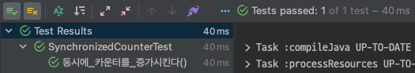
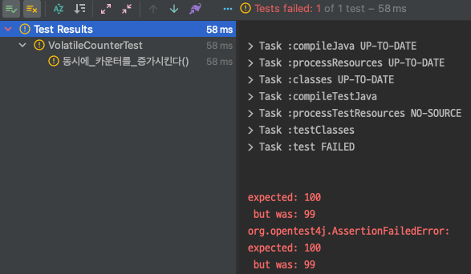

# java-concurrency

## 동시성 문제 Java 내에서 고민해보기

java는 기본적으로 멀티 스레드 환경에서 동작한다. 여러 스레드는 각각의 스택 영역을 가지고 있지만 힙과 같은 공유 영역을 함께 사용하기 때문에 자원을 두고 여러 문제가 발생할 수 있다. 이렇게 여러 스레드
환경에서도 문제 없이 동작하는 것을 스레드 세이프하다고 말한다.

## synchronized

동시성 이슈를 해결하는 가장 간단한 방법은 `synchronized`를 사용하는 것이다. `synchronized`를 통해 임계 영역이 설정된 부분은 오직 하나의 스레드만 접근이 가능하다. 하나만 스레드만 처리가
가능하기 때문에 병렬 처리의 효율은 낮아진다.

```java
public class SynchronizedCounter {

    private static int count = 0;

    public synchronized void increase() {
        count++;
    }

    public void increaseWithBody() {
        synchronized (this) {
            count++;
        }
    }

    public static void increaseWithStatic() {
        synchronized (SynchronizedCounter.class) {
            count++;
        }
    }

    public static int getCount() {
        return count;
    }
}
```

`synchronized`는 객체(인스턴스)나 클래스 메서드에도 설정이 가능하다. 클래스 메서드에 `synchronized`할 경우 메서드를 사용하는 모든 객체가 점유가 해제될 때 까지 기다린다.

```java
public class SynchronizedCounterTest {

    @Test
    void 동시에_카운터를_증가시킨다() throws InterruptedException {
        SynchronizedCounter synchronizedCounter = new SynchronizedCounter();

        var executorService = Executors.newFixedThreadPool(10);
        var countDownLatch = new CountDownLatch(100);
        for (int i = 0; i < 100; i++) {
            executorService.submit(() -> {
                try {
                    synchronizedCounter.increase();
                } finally {
                    countDownLatch.countDown();
                }
            });
        }

        countDownLatch.await();

        assertThat(SynchronizedCounter.getCount()).isEqualTo(100);
    }
}
```



> `synchronized`의 경우 임계 영역에 진입 전에 CPU 캐시 메모리와 메인 메모리의 값을 동기화하여 가시성을 해결한다.

## volatile

## 가시성 문제

여러 개의 스레드가 사용되며 CPU 캐시 메모리와 메인 메모리의 데이터가 서로 일치하는 않는 문제가 발생한다. 이것을 해결하기 위해 가시성이 보장되어야 하는 변수를 메인 메모리에서 바로 읽도록 해야 한다.
이때 `volatile`을 사용하면 가시성을 보장할 수 있다.

하지만 가시성 보장이 곧 동시성 보장을 의미하는 것은 아니다. 단순히 여러 스레드에서 최신의 값을 보게할 뿐이다. 그렇기 때문에 아래와 같이 테스트를 수행하면 간혈적으로 테스트가 실패하는 것을 확인할 수 있다.

```java
public class VolatileCounter {

    private static volatile int count = 0;

    public void add() {
        count++;
    }

    public int getCount() {
        return count;
    }
}
```

```java
public class VolatileCounterTest {

    @Test
    void 동시에_카운터를_증가시킨다() throws InterruptedException {
        VolatileCounter volatileCounter = new VolatileCounter();

        var executorService = Executors.newFixedThreadPool(10);
        var countDownLatch = new CountDownLatch(100);
        for (int i = 0; i < 100; i++) {
            executorService.submit(() -> {
                try {
                    volatileCounter.add();
                } finally {
                    countDownLatch.countDown();
                }
            });
        }

        countDownLatch.await();

        assertThat(volatileCounter.getCount()).isEqualTo(100);
    }
}
```



결국 `volatile`도 결국 온전히 동시성 이슈를 해결할 수 없다. `volatile`의 가장 큰 장점은 상호 배제를 제공하지 않아도 데이터의 `가시성`을 보장한다는 것이다.

## Atomic

`atomic`이란 원자를 의미한다. 원자의 사전적 의미는 더이상 쪼갤 수 없는 최소 단위를 말한다. `원자성(Atomicity)`은 이러한 원자의 특성을 가진 것을 의미한다. 소프트웨어의 원자성은 어떤 의미일까?

원자성은 한 줄의 프로그램 코드가 컴파일러에 의해 기계어도 변경되면 기계가 순차적인 처리를 위해 여러 개의 기계가 수행할 수 있는 명령어로 나뉜다. 멀티 스레드 환경에서 한 스레드가 각 기계 명령어를 수행하는 동안
다른 스레드가 개입하게 되면 같은 명령어를 수행할 수 있기 때문에 동시성 이슈가 발생할 수 있다. 앞서 사용한 `volatile`의 경우 가시성은 보장되지만 원자성을 보장하지 못한다.

이 원자성 해결을 위해서는 Atomic한 객체를 활용해야 한다. Java에서는 Atomic한 Wrapper 클래스가 지원된다. atomic은 synchronized와 같은 blocking 방식이 아닌
`CAS(Compared and Swap)`이라는 알고리즘을 통해 원자성을 보장한다.

### CAS (CompareAndSwap)

`CAS`이란 `volatile`에서 설명했던 CPU 캐시 메모리와 메인 메모리를 비교하여 일치한다면 CPU 캐시 메모리와 메인 메모리에 적용하고, 일치하지 않는다면 재시도하여 공유 자원 읽기/쓰기 작업에 원자성을
보장한다. `Non-blocking`으로 동작하기 때문에 빠른 속도로 로직 처리가 가능하다.

```java
class AtomicCounterTest {

    @Test
    void 동시에_카운터를_증가시킨다() throws InterruptedException {
        AtomicCounter atomicCounter = new AtomicCounter();

        var executorService = Executors.newFixedThreadPool(10);
        var countDownLatch = new CountDownLatch(100);
        for (int i = 0; i < 100; i++) {
            executorService.submit(() -> {
                try {
                    atomicCounter.increase();
                } finally {
                    countDownLatch.countDown();
                }
            });
        }

        countDownLatch.await();

        assertThat(atomicCounter.getCount()).isEqualTo(100);
    }
}
```


