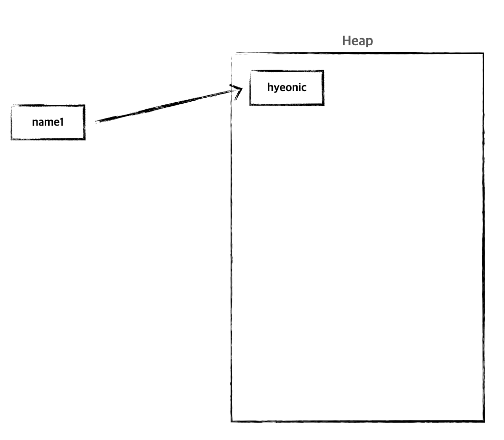
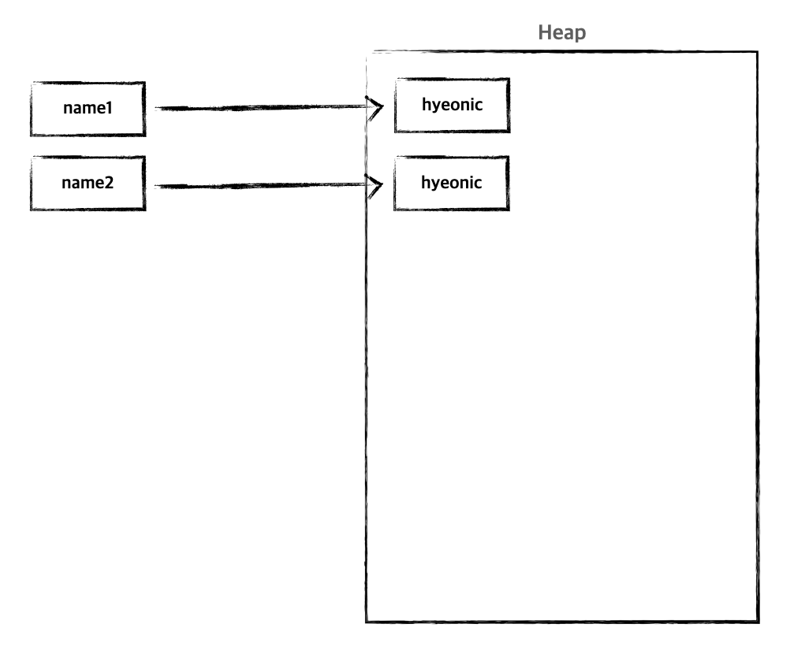
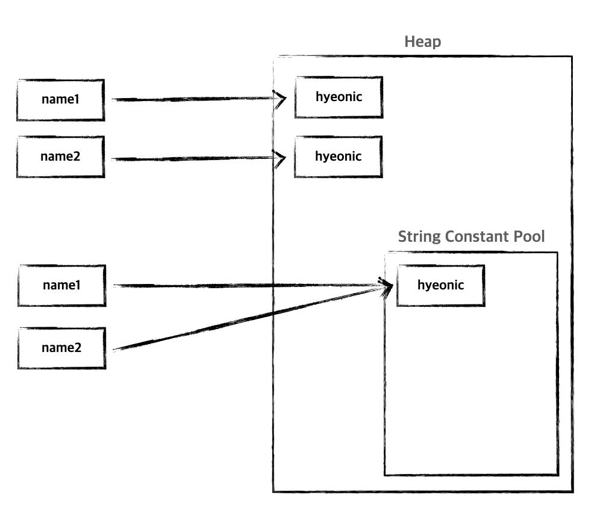

# java-string

Java는 객체지향 언어이기 때문에 기본적으로 제공하는 `Primitive Type`이 아닌 경우 모두 `객체`로 구성되어 있다. 이것은 문자열도 마찬가지다. 다만 `문자열`은 여타 다른 객체와 차이점을 가지고
있다.
그것은 바로 `문자열 리터럴`을 지원한다는 것이다.

## 문자열 생성 방법

Java에서 문자열을 생성하는 방법에는 두 가지가 있다.

* 생성자를 활용한 방식
* 문자열 리터럴을 활용한 방식

### 생성자를 활용한 방식

```
String name1 = new String("hyeonic");
```

다른 객체 생성 방식과 동일하게 new 키워드를 통해 String 객체를 생성한다. 메모리 또한 Heap 영역에 할당된다.



생성자를 활용한 방식은 동일한 문자열로 생성하여도 heap 영역에 새롭게 할당된다.

```
String name1 = new String("hyeonic");
String name2 = new String("hyeonic");
```



### 문자열 리터럴을 활용한 방식

리터럴을 활용할 경우 heap 영역에 특수하게 존재하는 `String Constant Pool` 영역에 할당되게 된다.

```
String name3 = "hyeonic";
String name4 = "hyeonic";
```



리터럴로 생성할 경우 동일한 문자열이면 `String Constant Pool`에 동일한 객체를 바라본다.

## 문자열 비교

생성자를 통해 생성한 문자열과 리터럴로 생성한 문자열을 비교해보자.

```java
public class StringTest {
    @Test
    void 문자열을_비교한다() {
        String name1 = new String("hyeonic");
        String name2 = "hyeonic";

        assertThat(name1.equals(name2)).isTrue();
        assertThat(name1 == name2).isFalse();
    }
}
```

`equals()` 메서드는 주로 동등성 비교를 위해 사용된다. 생성자로 생성했던 리터럴로 생성했던 문자열의 내용만 같다면 `true`를 반환한다. 실제 String이 재정의한 `equals()`를 살펴보면 그에
대한 해답을 쉽게 찾을 수 있다.

```java
public final class String
        implements java.io.Serializable, Comparable<String>, CharSequence {
    // ...
    public boolean equals(Object anObject) {
        if (this == anObject) {
            return true;
        }
        if (anObject instanceof String) {
            String aString = (String) anObject;
            if (coder() == aString.coder()) {
                return isLatin1() ? StringLatin1.equals(value, aString.value)
                        : StringUTF16.equals(value, aString.value);
            }
        }
        return false;
    }
    // ...
}
```

우선 참조 주소를 비교하여 같다면 `true`를 반환한다. 아니라면 동일한 문자 시퀀스인지 확인한다.

생성자를 통한 방식과 리터럴을 활용한 방식이 heap 영역에 서로 다른 객체를 바라보기 때문에 참조 주소를 비교하여 동일성을 확인하는 `==`는 `false`가 반환된다.

## 문자열 리터럴은 어떻게 생성될까?

문자열 리터럴을 사용할 경우 내부적으로 `String`의 `intern()` 메서드를 활용하게 된다.

```java
public final class String
        implements java.io.Serializable, Comparable<String>, CharSequence {
    // ...
    public native String intern();
    // ...
}
```

문자열 객체에 대한 표준을 반환한다. 처음에는 비어있는 문자열 풀은 String 클래스에 의해 개인적으로 유지된다.

`intern()` 메서드가 호출될 때 풀에 `equals()` 메서드에 의해 결정된 대로 이 String 객체와 동일한 문자열이 포함되어 있으면 풀의 문자열이 반환된다. 그렇지 않으면 이 String 객체가 풀에
추가되고 String 객체에 대한 참조가 반환된다.

## 그렇다면 hashCode()는?

같은 값을 가지는 생성자 방식의 문자열과 리터럴 방식의 문자열의 `hashCode()`를 비교하면 어떤 결과가 나올까? 바로 확인해보자.

```java
public class StringTest {
    @Test
    void hashCode를_비교한다() {
        String name1 = new String("hyeonic");
        String name2 = "hyeonic";

        assertThat(name1.hashCode() == name2.hashCode()).isTrue();
    }

}
```

같은 문자열 값을 가진 두 문자열의 `hashCode()`를 비교할 경우 같다는 결과가 나온다. 추측컨데 두 문자열 모두 값을 기반으로 `hashCode()`를 생성하기 때문에 이러한 결과가 나온 것으로 판단한다.

실제 String에 `hashCode()` 구현부를 살펴보면 재정의한 것을 확인할 수 있다. 핵심은 같은 문자열인 경우 같은 `hashCode()`를 반환할 수 있다는 것을 의미한다.

```java
public final class String
        implements java.io.Serializable, Comparable<String>, CharSequence {
    // ...
    public int hashCode() {
        int h = hash;
        if (h == 0 && value.length > 0) {
            hash = h = isLatin1() ? StringLatin1.hashCode(value)
                    : StringUTF16.hashCode(value);
        }
        return h;
    }
    // ...
}
```

```java
final class StringLatin1 {
    // ...
    public static int hashCode(byte[] value) {
        int h = 0;
        for (byte v : value) {
            h = 31 * h + (v & 0xff);
        }
        return h;
    }
    // ...
}
```

```java
final class StringUTF16 {
    // ...
    public static int hashCode(byte[] value) {
        int h = 0;
        int length = value.length >> 1;
        for (int i = 0; i < length; i++) {
            h = 31 * h + getChar(value, i);
        }
        return h;
    }
    // ...
}
```

> 두 가지 타입으로 구분된 이유는 Jdk 9부터 새롭게 도입된 Compact String으로 인해 바이트 배열 기반으로 구현되어 있기 때문이다. 문자열에 따라 Latin-1 혹은 UTF-16으로 인코딩된 문자를
> 저장한다. 자세한 내용은 따로 다룰 예정이다.

그렇다면 문자열이 실제로 저장되는 주소 값을 어떻게 확인할 수 있을까? String이 저장된 실제 주소값을 확인하는 방법은 `System.identityHashCode()`를 사용하는 것이다.

```java
public class StringTest {
    @Test
    void 실제_주소를_비교한다() {
        String name1 = new String("hyeonic");
        String name2 = "hyeonic";

        assertThat(System.identityHashCode(name1) != System.identityHashCode(name2)).isTrue();
    }
}
```

실제로 두 주소는 같지 않다. 즉 두 String 객체가 별도로 저장되는 것을 확인할 수 있는 부분이다.

## 정리

지금까지 문자열 생성 방식에 따른 차이를 확인하였다. 생성자를 활용할 경우 매번 새롭게 heap 영역을 할당한다. 리터럴를 활용할 경우 heap 영역에 String Constant Pool에서 관리되기 때문에 같은
값을 가진 문자열인 경우 기존의 주소를 공유해서 사용한다. 리터럴로 생성한 문자열은 기본적으로 공유된다. 그렇기 때문에 String은 Java의 대표적인 불변 객체이다.

정리하면 문자열 리터럴 사용 시 메모리 측면에 많은 이점을 가져올 수 있다. 만약 같은 문자열 값을 가진 String을 100만 개 생성한다고 가정해본다. 생성자를 사용할 경우 100만 개의 문자열 객체가 생성되는
것이지만 리터럴은 단 1개의 문자열만 생성하고 공유한다. 문자열 생성은 리터럴를 적극 활용하자!

## References.

[Class String](https://docs.oracle.com/en/java/javase/11/docs/api/java.base/java/lang/String.html)<br>
[자바의 String 객체와 String 리터럴](https://madplay.github.io/post/java-string-literal-vs-string-object)<br>
[[번역] Compact Strings in Java 9](https://xlffm3.github.io/java/compact-string/)
