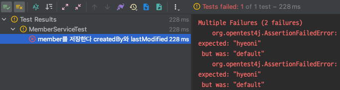
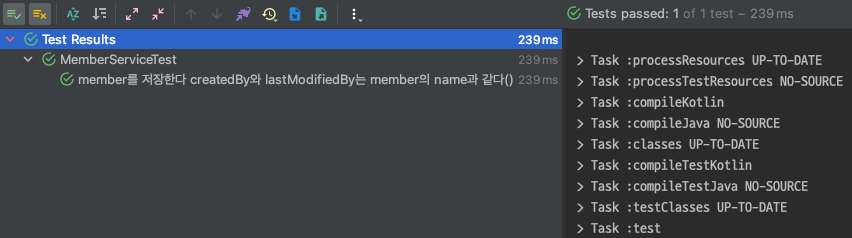

_# jpa-auditing

kotlin + spring을 활용하여 JPA Auditing 기능을 구현하고 추상화한다.

## Spring Data JPA Auditing

Spring Data는 엔티티를 `생성`하거나 `변경한 사람`과 `변경이 발생한 시기`를 투명하게 추적할 수 있는 정교한 지원을 제공한다.
해당 기능을 사용하기 위해서는 애노테이션을 사용하거나 인터페이스를 구현하여 정의할 수 있는 auditing metadata를 제공해야 한다.

아래는 간단한 예시를 위한 Member 엔티티이다.

```kotlin
@Entity
class Member(
    name: String
) : BaseEntity() {

    @Id
    @GeneratedValue(strategy = GenerationType.IDENTITY)
    var id: Long? = null
        protected set

    @Column
    var name: String = name
        protected set
}
```

사용 방법은 정말 간단하다. 애노테이션만 몇 개 추가해주면 자동으로 생성과 수정 시점에 따라 값이 수정된다.

```kotlin
@EntityListeners(AuditingEntityListener::class)
@Entity
class Member(
    name: String
) : BaseEntity() {

    @Id
    @GeneratedValue(strategy = GenerationType.IDENTITY)
    var id: Long? = null
        protected set

    @Column
    var name: String = name
        protected set

    @CreatedDate
    @Column(nullable = false, updatable = false)
    var createdDate: LocalDateTime = LocalDateTime.MIN
        protected set

    @LastModifiedDate
    @Column(nullable = false)
    var lastModifiedDate: LocalDateTime = LocalDateTime.MIN
        protected set

    @CreatedBy
    @Column(nullable = false, updatable = false)
    var createdBy: String = DEFAULT_MEMBER_NAME
        protected set

    @LastModifiedBy
    @Column(nullable = false)
    var lastModifiedBy: String = DEFAULT_MEMBER_NAME
        protected set

    companion object {
        const val DEFAULT_MEMBER_NAME = "default"
    }
}
```

> 이번 글에서는 Auditing 기능에만 집중할 예정이므로 Kotlin과 JPA와 관련한 내용은 생략한다.

* `@EntityListeners(AuditingEntityListener::class)`: Spring Data JPA는 auditing 정보 캡처를 트리거할 때 사용할 수 있는 `EntityListener`와
  함께 제공된다. 사용할 엔티티에 `AuditingEntityListener`를 등록한다. 자세한 동작과정은 이후 살펴본다. 우선 auditing 기능을 위해서는 리스너를 등록해야 한다는 것만 알아두자.
* `@CreatedDate`: 엔티티가 생성되어 저장될 때 시간이 자동으로 저장된다.
* `@LastModifiedDate`: 엔티티가 변경되면 시간이 자동으로 수정된다.
* `@CreatedBy`: 엔티티를 생성한 사람을 자동으로 넣을 수 있다. 해당 기능이 정상 작동하기 위해서는 `AuditorAware`를 빈으로 등록해야 한다. 자세한 사용 방법은 이후 살펴본다.
* `@LastModifiedDate`: 엔티티가 변경되면 변경한 사람이 자동으로 수정된다. 정상 작동 방법은 `@CreatedBy`와 동일하게 이후 작성한다.

엔티티마다 Auditing 기능을 위해 `createdDate`, `lastModifiedDate` 등을 매번 작성하는 것은 중복된 코드를 야기한다. 이것은 상속을 통해 개선이 가능하다.

```kotlin
@MappedSuperclass
@EntityListeners(AuditingEntityListener::class)
class BaseEntity {

    @CreatedDate
    @Column(nullable = false, updatable = false)
    var createdDate: LocalDateTime = LocalDateTime.MIN
        protected set

    @LastModifiedDate
    @Column(nullable = false)
    var lastModifiedDate: LocalDateTime = LocalDateTime.MIN
        protected set

    @CreatedBy
    @Column(nullable = false, updatable = false)
    var createdBy: String = DEFAULT_MEMBER_NAME
        protected set

    @LastModifiedBy
    @Column(nullable = false)
    var lastModifiedBy: String = DEFAULT_MEMBER_NAME
        protected set

    companion object {
        const val DEFAULT_MEMBER_NAME = "default"
    }
}
```

```kotlin
@Entity
class Member(
    name: String
) : BaseEntity() {

    @Id
    @GeneratedValue(strategy = GenerationType.IDENTITY)
    var id: Long? = null
        protected set

    @Column
    var name: String = name
        protected set
}
```

`BaseEntity()`를 상속하여 Member 엔티티가 더욱 간단해진 것을 확인할 수 있다. 이제 마지막으로 Auditing 기능을 활성화해준다.

```kotlin
@Configuration
@EnableJpaAuditing
class JpaConfig
```

보통 Configuration 파일은 각 역할에 맞게 분리하여 관리한다. 이러한 방식의 장점은 슬라이스 테스트를 진행할 때 필요한 설정 빈만 활용하여 테스트를 진행할 수 있다. 자세한
이유는 [8.3.33. User Configuration and Slicing](https://docs.spring.io/spring-boot/docs/current/reference/html/features.html#features.testing.spring-boot-applications.user-configuration-and-slicing)
에서 확인할 수 있다.

아래는 간단한 repository와 service이다.

**MemberRepository.kt**

```kotlin
interface MemberRepository : JpaRepository<Member, Long>
```

**MemberService.kt**

```kotlin
@Service
class MemberService(
    private val memberRepository: MemberRepository
) {

    @Transactional
    fun save(member: Member): Member {
        return memberRepository.save(member)
    }
}
```

간단한 테스트 코드를 작성한다.

```kotlin
@SpringBootTest
class MemberServiceTest @Autowired constructor(
    private val memberService: MemberService
) {

    @Test
    fun `member를 저장한다`() {
        val name = "hyeoni"
        val savedMember = memberService.save(Member(name))

        val result = memberService.getOne(savedMember.id!!)

        println(result)
    }
}
```

```console
Member(id=1, name=hyeoni, createdDate=2023-03-06T22:21:16.911, lastModifiedDate=2023-03-06T22:21:16.911, createdBy='default', lastModifiedBy='default')
```

`createdDate`와 `updatedDate`를 살펴보면 테스트 시작 시간이 잘 등록된 것을 확인할 수 있다. 추가로 `createdBy`와 `lastModifiedBy`에는 생성 및 수정이 일어날 때
member의 name이 기록해야 하는 요구사항이 있다고 가정한다. 현재는 무슨 이유인지 모르겠지만 `Member Entity`에 기본적으로 설정된 값이 출력되는 것을 확인할 수 있다.

```kotlin
@SpringBootTest
class MemberServiceTest @Autowired constructor(
    private val memberService: MemberService
) {

    @Test
    fun `member를 저장한다 createdBy와 lastModifiedBy는 member의 name과 같다`() {
        val name = "hyeoni"
        val savedMember = memberService.save(Member(name))

        val result = memberService.getOne(savedMember.id!!)

        assertAll(
            { assertThat(result.createdBy).isEqualTo(name) },
            { assertThat(result.lastModifiedBy).isEqualTo(name) }
        )
    }
}
```



위 테스트는 실패한다. 가정한 요구사항을 수행하기 위해서는 추가적인 설정이 필요하다.

## AuditorAware

이것은 `AuditorAware`의 구현체를 `Bean`으로 등록하여 해결할 수 있다. 요구사항에 맞춰 해당 채워 넣을 값을 세팅한다. 보통은 `Spring Security`의 `Authentication`
이나 `Session` 등 을 활용하여 구현하곤 한다. 아래는 실제 공식 문서에 있는 간단한 활용 예시이다.

```java
class SpringSecurityAuditorAware implements AuditorAware<User> {

    @Override
    public Optional<User> getCurrentAuditor() {
        return Optional.ofNullable(SecurityContextHolder.getContext())
                .map(SecurityContext::getAuthentication)
                .filter(Authentication::isAuthenticated)
                .map(Authentication::getPrincipal)
                .map(User.class::cast);
    }
}
```

간단한 예제를 위해 스레드별로 요청한 Member의 name을 저장하기 위해 `ThreadLocal`를 가진 `RequestContext`을 활용한다.

```kotlin
class RequestContext {

    companion object {
        private val currentAuditorStore = ThreadLocal<String?>()

        var currentAuditor: String
            get() = currentAuditorStore.get() ?: "default"
            set(currentAuditor) {
                currentAuditorStore.remove()
                return currentAuditorStore.set(currentAuditor)
            }
    }
}
```

정말 간단한 예시이다. 자 이제 service 쪽도 저장하기 직전에 `RequestContext`에 값을 채워둔다.

```kotlin
@Service
@Transactional(readOnly = true)
class MemberService(
    private val memberRepository: MemberRepository
) {

    @Transactional
    fun save(member: Member): Member {
        RequestContext.currentAuditor = member.name
        return memberRepository.save(member)
    }
}
```

이제 `RequestContext`에 저장된 `name`을 활용하여 `AuditorAware`를 구현하고 빈으로 등록한다.

```kotlin
@Configuration
class JpaConfig {

    @Bean
    fun auditorProvider(): AuditorAware<String> {
        return AuditorAware {
            Optional.of(RequestContext.currentAuditor)
        }
    }
}
```

자 이제 아래 테스트를 다시 수행한다.

```kotlin
@SpringBootTest
class MemberServiceTest @Autowired constructor(
    private val memberService: MemberService
) {

    @Test
    fun `member를 저장한다 createdBy와 lastModifiedBy는 member의 name과 같다`() {
        val name = "hyeoni"
        val savedMember = memberService.save(Member(name))

        val result = memberService.getOne(savedMember.id!!)

        assertAll(
            { assertThat(result.createdBy).isEqualTo(name) },
            { assertThat(result.lastModifiedBy).isEqualTo(name) }
        )
    }
}
```



정상적으로 통과하는 것을 확인할 수 있다.

## [번외] AuditingEntityListener

Auditing 기능이 정상적으로 동작하기 위해서는 `@EntityListeners(AuditingEntityListener::class)`를 통해 리스너를 등록해야 한다. 엔티티의 메서드는 특정 엔티티 라이프
사이클 이벤트의 알림을 수신하기 위한 콜백 메서드(e.g. `@PrePersist` 등)로 지정될 수 있다. 다만 클래스 단위로 범용적인 사이클 적용을 위해서는 리스너를 활용할 수 있다.

실제 `AuditingEntitiyListener`를 살펴보자.

```java

@Configurable
public class AuditingEntityListener {
    // ...
    @PrePersist
    public void touchForCreate(Object target) {
        Assert.notNull(target, "Entity must not be null!");
        if (handler != null) {
            AuditingHandler object = handler.getObject();
            if (object != null) {
                object.markCreated(target);
            }
        }
    }

    @PreUpdate
    public void touchForUpdate(Object target) {
        Assert.notNull(target, "Entity must not be null!");
        if (handler != null) {
            AuditingHandler object = handler.getObject();
            if (object != null) {
                object.markModified(target);
            }
        }
    }
}
```

특정 시점에 `@PrePersist`와 `@PreUpdate`애노테이션이 명시된 메서드를 수행하는 것을 확인할 수 있다.

## 정리

지금까지 JPA Auditing 필요성과 사용 방법에 대해 알아보았다. 날짜와 관련한 필드는 `@CreatedDate`와 `@LastModifiedDate` 애노테이션을 통해 정말 빠르게 적용이 가능하다.
다만 `@CreatedBy`와 `@LastModifiedBy`는 추가적으로 `AditorAware`를 빈으로 등록해야 한다.

엔티티의 라이프 사이클 이벤트 알림을 수신하기 위한 애노테이션을 사용할 수 있다. 여러 엔티티에서 사용하는 것은 리스너를 생성하여 `@EntityListeners`에 등록한 뒤 사용할 수 있다.

## References.

* [5.1.9. Auditing](https://docs.spring.io/spring-data/jpa/docs/current/reference/html/#auditing)
* [Chapter 6. Entity listeners and Callback methods](https://docs.jboss.org/hibernate/stable/entitymanager/reference/en/html/listeners.html)_
