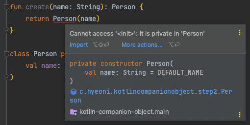

_# kotlin-companion-object

> **companion**
>
> 동반자

kotlin은 클래스 내부에 오직 하나의 `companion object`를 가질 수 있다. 먼저 kotlin에서 사용되는 `object` 키워드부터 살펴본다.

## object

kotlin은 `싱글톤 패턴`을 쉽게 선언할 수 있다. 이러한 `싱글톤 패턴`은 여러 상황에서 유용하게 사용될 수 있다. object 키워드를 활용하면 아래와 같이 편리하게 싱글톤 객체를 만들 수 있다.

```kotlin
object StringSplitter {

    fun split(value: String, delimiter: String): List<String> {
        return value.split(delimiter)
    }
}
```

언어 차원에서 싱글톤을 보장하기 때문에 더욱 안전하게 활용될 수 있다.

> 싱글턴 패턴은 객체의 인스턴스가 오직 1개만 생성하는 패턴을 말한다. 장단점과 자세한 설명은 생략한다.

## companion object

클래스 내부에 오직 하나만 존재할 수 있는 `companion object`이다. object 이므로 말 그대로 객체이다. 또한 객체 내부에 싱글톤 객체로 관리된다.

> companion object도 객체이므로 인터페이스 구현, 상속 등이 가능하다.

```kotlin
class Person(
    val name: String = DEFAULT_NAME
) {

    companion object {
        const val DEFAULT_NAME = "hyeoni"
    }
}
```

`companion object`는 `java의 static 키워드`를 활용한 `클래스 변수`나 `클래스 메서드`처럼 간편하게 접근하여 사용할 수 있다.

> kotlin에는 static 키워드가 존재하지 않는다.

```kotlin
class PersonTest {

    @Test
    fun `default name을 조회한다`() {
        val defaultName = Person.DEFAULT_NAME

        assertThat(defaultName).isEqualTo("hyeoni")
    }
}
```

핵심은 companion object를 사용하면 단순한 static 키워드와는 다르게 Person 내부에 독립된 객체로 다룰 수 있다는 것이다.

### 이름 부여하기

```kotlin
class PersonTest {
    @Test
    fun `default name을 조회한다 - 2`() {
        val defaultName = Person.Companion.DEFAULT_NAME

        assertThat(defaultName).isEqualTo("hyeoni")
    }
}
```

`companion object`에는 이름도 부여할 수 있다. 이름을 부여하지 않는다면 `Companion`이라는 이름을 가진다. 하지만 생략도 가능하다.

이름을 부여하는 것은 간단한다.

```kotlin
class Person(
    val name: String = DEFAULT_NAME
) {

    companion object Constant {
        const val DEFAULT_NAME = "hyeoni"
    }
}
```

```kotlin
class PersonTest {
    @Test
    fun `default name을 조회한다 - 3`() {
        val defaultName = Person.Constant.DEFAULT_NAME

        assertThat(defaultName).isEqualTo("hyeoni")
    }
}
```

`companion object`는 오직 하나만 생성이 가능하다. 그렇기 때문에 이름을 생략하고 `Person`만 가지고도 접근이 가능하다.

## 패키지 수준의 최상의 함수

`패키지 수준의 최상의 함수`를 활용해도 위와 유사한 효과를 얻을 수 있다.

```kotlin
const val DEFAULT_NAME = "hyeoni"

class Person(
    val name: String = DEFAULT_NAME
)
```

```kotlin
const val DEFAULT_NAME = "hyeoni"

fun create(name: String): Person {
    return Person(name)
}

class Person(
    val name: String = DEFAULT_NAME
)
```

하지만 Person 내부에 private에는 접근할 수 없다는 것이 `companion object`와 가장 큰 차이점이다.

```kotlin
const val DEFAULT_NAME = "hyeoni"

fun create(name: String): Person {
    return Person(name)
}

class Person private constructor(
    val name: String = DEFAULT_NAME
)
```



## 팩토리 메서드로 활용하기

생성자를 활용하여 직접 객체를 생성하는 것이 아니라 특정 메서드를 통해 객체를 생성한다. 생성 방식을 제한하거나 적절히 캡슐화할 수 있다.

```kotlin
class Person private constructor(
    val name: String
) {

    companion object Constant {
        const val DEFAULT_NAME = "hyeoni"

        fun create(name: String = DEFAULT_NAME): Person {
            return Person(name)
        }
    }
}
```

java에서는 이러한 팩토리 메서드를 생성하기 위해서는 static 키워드를 통해 클래스 메서드를 생성해야 한다. kotlin에서는 static 키워드를 활용하지 않기 때문에 companion object를 통해
작성할 수 있다.

```kotlin
class PersonTest {
    @Test
    fun `factory method로 person을 생성한다`() {
        val person = Person.create()

        assertThat(person.name).isEqualTo("hyeoni")
    }
}
```

## java로 변환하기

`companion object`를 가진 클래스의 바이트코드를 통해 `decompile`할 경우 어떠한 java 코드로 변환되는지 확인해본다.

변환하기 위한 코드는 아래와 같다.

```kotlin
class Person private constructor(
    private val name: String = DEFAULT_NAME
) {

    companion object {
        const val DEFAULT_NAME = "hyeoni"

        fun create(name: String = DEFAULT_NAME): Person {
            println(DEFAULT_NAME)
            return Person(name)
        }
    }
}
```

변환된 java 코드는 아래와 같다.

```java
public final class Person {
    private final String name;
    @NotNull
    public static final String DEFAULT_NAME = "hyeoni";
    @NotNull
    public static final Companion Companion = new Companion((DefaultConstructorMarker) null);

    private Person(String name) {
        this.name = name;
    }

    Person(String var1, int var2, DefaultConstructorMarker var3) {
        if ((var2 & 1) != 0) {
            var1 = "hyeoni";
        }

        this(var1);
    }

    public Person(String name, DefaultConstructorMarker $constructor_marker) {
        this(name);
    }

    public static final class Companion {
        @NotNull
        public final Person create(@NotNull String name) {
            Intrinsics.checkNotNullParameter(name, "name");
            String var2 = "hyeoni";
            System.out.println(var2);
            return new Person(name, (DefaultConstructorMarker) null);
        }

        public static Person create$default(Companion var0, String var1, int var2, Object var3) {
            if ((var2 & 1) != 0) {
                var1 = "hyeoni";
            }

            return var0.create(var1);
        }

        private Companion() {
        }

        public Companion(DefaultConstructorMarker $constructor_marker) {
            this();
        }
    }
}
```

먼저 `DEFAULT_NAME`은 `static final` 형태로 선언된 것을 확인할 수 있다. 이것은 우리가 java에서 일반적으로 상수를 사용하는 방법처럼 변환된다.
한 가지 특이한 점은 바로 `static final class Companion`이다. 위 코드를 통해 `companion object`의 `default` 이름이 `Companion`인지에 대해 알 수 있게
되었다.

`const val`의 경우 `compile 시점`에 바로 결정되기 때문에 해당 상수를 사용하면 `String var2 = "hyeoni"` 처럼 바로 변환되는 것을 확인할 수 있다.
만약 `const`를 생략할 경우 아래와 같이 추가적인 get 메서드가 생성되어 활용된다.

```java
public final class Person {
    // ...
    public static final class Companion {
        @NotNull
        public final String getDEFAULT_NAME() {
            return Person.DEFAULT_NAME;
        }

        @NotNull
        public final Person create(@NotNull String name) {
            Intrinsics.checkNotNullParameter(name, "name");
            String var2 = ((Companion) this).getDEFAULT_NAME();
            System.out.println(var2);
            return new Person(name, (DefaultConstructorMarker) null);
        }

        public static Person create$default(Companion var0, String var1, int var2, Object var3) {
            if ((var2 & 1) != 0) {
                var1 = var0.getDEFAULT_NAME();
            }

            return var0.create(var1);
        }

        private Companion() {
        }

        public Companion(DefaultConstructorMarker $constructor_marker) {
            this();
        }
    }
}
```

## References.

* [Object expressions and declarations](https://kotlinlang.org/docs/object-declarations.html)
* [[kotlin] Companion Object (1) - 자바의 static과 같은 것인가?](https://www.bsidesoft.com/8187)_
