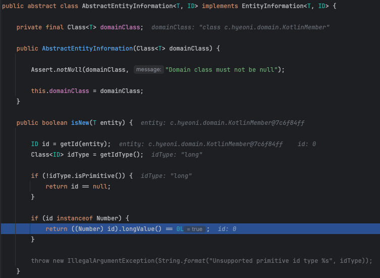

# kotlin-with-jpa

`kotlin`과 `JPA`를 함께 사용할 때 `null` 처리와 관련된 문제를 제시하고 이에 대한 해결책을 고민한다.

```kotlin
@Entity
class KotlinMember(
    @Id
    @GeneratedValue(strategy = GenerationType.IDENTITY)
    var id: Long = 0L,

    @Column(name = "name", length = 100, nullable = false)
    var name: String
)
```




```java
@Entity
public class KotlinMember {
   @Id
   @GeneratedValue(strategy = GenerationType.IDENTITY)
   private long id;
   
   @Column(
      name = "name",
      length = 100,
      nullable = false
   )
   @NotNull
   private String name;

    // ...
}
```

---

```kotlin
@Entity
class KotlinMember(
    @Id
    @GeneratedValue(strategy = GenerationType.IDENTITY)
    var id: Long? = 0L,

    @Column(name = "name", length = 100, nullable = false)
    var name: String
)
```


```java
@Entity
public class KotlinMember {
    @Id
    @GeneratedValue(strategy = GenerationType.IDENTITY)
    @Nullable
    private Long id;
    
    @Column(
            name = "name",
            length = 100,
            nullable = false
    )
    @NotNull
    private String name;

    // ...
}
```
