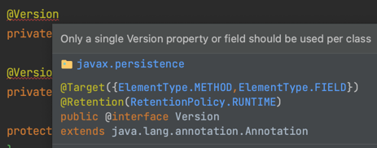
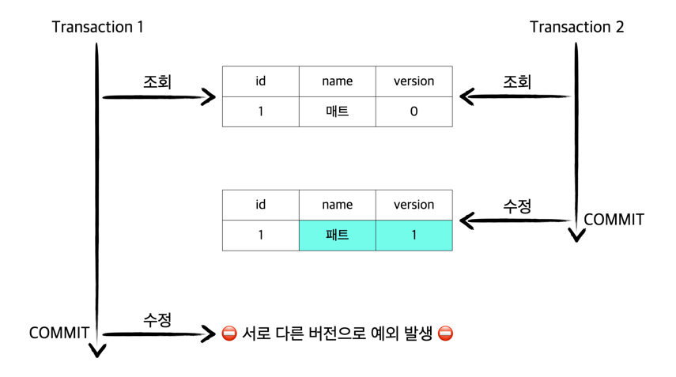

# optimistic-locking

## 낙관적 락

트랜잭션 충돌이 발생하지 않는다고 낙관적으로 가정한다. 추가적인 `version`을 기반으로 충돌할 경우 롤백을 진행한다.  가장 큰 장점은 충돌이 일어나지 않는다고 가정하기 때문에 동시 처리에 대한 이점이 많다.

## @Version

낙관적 락을 사용하는 방법은 여러가지가 있지만 대표적으로는 `@Version` 애노테이션을 사용하는 방법이다. `@Version`은 낙관적 락 값으로 사용되는 엔터티 클래스의 버전 필드 또는 속성을 지정한다. 이 버전은 병합 작업을 수행할 때 무결성을 보장하고 낙관적 동시성 제어를 위해 사용 된다. `@Version`은 클래스당 하나의 속성 또는 필드만 사용해야 한다. 둘 이상의 버전 또는 속성 필드를 사용할 수 없다.



`@Version`은 엔티티 클래스의 기본 테이블에 매핑되어야 한다. 기본 테이블이 아닌 다른 테이블에 매핑할 수 없다. `@Version`이 지원되는 type은 `int`, `Integer`, `short`, `Short`, `long`, `Long`, `java.sql.Timestamp`이다. `@Version`이 사용된 엔티티는 수정될 때 자동으로 버전이 증가하며 수정할 때 조회 시점과 버전이 다른 경우 예외가 발생한다.



이러한 버전은 엔티티 수정 시점에 최신화되며 JPA에 의해 자동적으로 관리된다.

```sql
update
    member
set name=?,
    version=?
where id = ?
  and version = ?
```

만약 WHERE 조건에 의해 수정할 대상이 없는 경우 버전이 증가 했다고 판단하여 예외를 던진다.

Spring Data JPA를 사용할 경우 JPA에 대한 구현체는 기본적으로 hibernate를 사용하게 된다. 이 예외는 기본적으로 hibernate에서 던지는 `StaleStateException` 예외를 Spring이 `HibernateJpaDialect`의 `convertHibernateAccessException()` 메서드를
통해 `org.springframework.dao` 계층에서 적절한 예외(DataAccessException 타입)로 변환된다.

```java
package org.springframework.orm.jpa.vendor;

// ...
public class HibernateJpaDialect extends DefaultJpaDialect {
    // ...
    protected DataAccessException convertHibernateAccessException(HibernateException ex) {
        // ...
        if (ex instanceof StaleStateException) {
            return new ObjectOptimisticLockingFailureException(ex.getMessage(), ex);
        }
        // ...
    }
}
```

### 적용

먼저 Version 칼럼을 사용하기 위한 `Member` 엔티티이다.

```java
@Entity
public class Member {

    @Id
    @GeneratedValue(strategy = GenerationType.IDENTITY)
    private Long id;

    @Column
    private String name;

    @Version
    private Long version;

    protected Member() {
    }

    public Member(final String name) {
        this.name = name;
    }

    public void changeName(final String name) {
        this.name = name;
    }

    // getter..
}
```

고유한 `id`와 이름을 나타내는 `name`을 가지고 있다. `@Version`을 통해 엔티티의 버전을 명시하기 위한 칼럼을 추가한다. 위 엔티티를 기반으로 자동으로 생성되는 테이블 DDL을 살펴보면 아래와 같다.

```sql
create table member
(
    id      bigint not null auto_increment,
    name    varchar(255),
    version bigint,
    primary key (id)
)
```

`version`이라는 칼럼이 추가적으로 생성되어 테이블이 생성된다. 이러한 Version 정보를 사용하면 최초에 적용된 커밋만 반영되고 나머지는 무시된다.

## 주의

`@Version`으로 추가한 필드는 JPA가 직접 관리한다. 그렇기 때문에 개발자가 임의로 수정하지 않도록 주의해야 한다. 단 `벌크 연산`의 경우에는 버전 증가를 위해 강제로 증가시켜야 한다.

> 벌크 연산이란?
> 
> 여러 건의 데이터를 한 번에 수정(update)하거나 삭제(delete)하는 것을 말한다. (hibernate는 insert도 지원한다.)
> 

## 테스트로 검증하기

낙관적 락이 잘 작동하는지 확인하기 위해서는 동시성 관련 테스트를 진행해야 한다. 이때 대표적으로 사용할 수 있는 방법 중 하나는 `CountDownLatch`를 사용하는 것이다.

### CountDownLatch

다른 스레드에서 수행 중인 일련의 작업이 완료될 때 까지 하나 이상의 스레드가 대기할 수 있도록 하는 동기화 지원이다.

`CountDownLatch`는 지정된 `count`로 초기화된다. `countDown()` 메서드의 호출로 인해 현재 카운트가 0에 도달할 때 까지 `await()` 메서드는 차단되며, 
그 후 대기 중인 모든 스레드가 해제되고 후속 `await()` 호출이 즉시 반환된다. 이것은 일회성 현상으로 카운트를 재설정할 수 없다. 카운트 재설정하는 버전이 필요할 경우 `CyclicBarrier` 사용을 고려한다.

자세한 사용 방법은 별도의 게시글로 작성할 예정이다.

이제 `CountDownLatch`를 활용하여 간단한 동시성 테스트를 진행해보자.

먼저 테스트 진행을 위한 `Member` 엔티티이다.

```java
@Entity
public class Member {

    @Id
    @GeneratedValue(strategy = GenerationType.IDENTITY)
    private Long id;

    @Column
    private String name;

    @Version
    private Long version;

    protected Member() {
    }

    public Member(final String name) {
        this.name = name;
    }

    public void changeName(final String name) {
        this.name = name;
    }

    // getter..
}
```

Member 엔티티 관리를 위한 `MemberRepository`이다.

```java
public interface MemberRepository extends JpaRepository<Member, Long> {
}
```

Member의 비즈니스 로직을 담당하는 `MemberService`이다. 동시성 테스트를 진행할 메서드의 대상이다.

```java
@Service
@Transactional(readOnly = true)
public class MemberService {

    private final MemberRepository memberRepository;

    public MemberService(final MemberRepository memberRepository) {
        this.memberRepository = memberRepository;
    }

    @Transactional
    public Member save(final Member member) {
        return memberRepository.save(member);
    }

    public Member findById(final Long id) {
        return getMember(id);
    }

    @Transactional
    public void changeName(final Long id, final String name) {
        Member foundMember = getMember(id);
        foundMember.changeName(name);
    }

    private Member getMember(final Long id) {
        return memberRepository.findById(id)
                .orElseThrow(NoSuchElementException::new);
    }
}
```

자 이제 동시성 테스트를 진행해보자.

```java
@SpringBootTest
class MemberServiceTest {
    
    private final MemberService memberService;

    @Autowired
    MemberServiceTest(final MemberService memberService) {
        this.memberService = memberService;
    }
    
    @Test
    void member를_동시에_수정한다() throws InterruptedException {
        Member member = memberService.save(new Member("version 0"));

        ExecutorService executorService = Executors.newFixedThreadPool(2);
        CountDownLatch countDownLatch = new CountDownLatch(2);

        AtomicInteger count = new AtomicInteger(0);
        for (int i = 0; i < 2; i++) {
            executorService.execute(() -> {
                try {
                    memberService.changeName(member.getId(), "version change");
                } catch (final ObjectOptimisticLockingFailureException e) {
                    count.incrementAndGet();
                } finally {
                    countDownLatch.countDown();
                }
            });
        }

        countDownLatch.await();

        Member actual = memberService.findById(member.getId());

        assertAll(() -> {
            assertThat(count.get()).isEqualTo(1);
            assertThat(actual.getName()).isEqualTo("version change");
        });
    }
}
```

 * `ExecutorService executorService = Executors.newFixedThreadPool(2)`: 제한된 개수의 스레드 풀을 관리한다. 
 * `CountDownLatch countDownLatch = new CountDownLatch(2)`: 스레드 대기를 위한 CountDownLatch이다.
 * `AtomicInteger count = new AtomicInteger(0)`: 여러 스레드에서 동시에 엑세스할 수 있는 환경에서 동시성을 보장하기 위한 Wrapper 클래스이다. 낙관적 락에서 던진 예외를 catch하고 count하기 위해 사용한다.
 * `countDownLatch.countDown()`: countDownLatch에서 명시한 count를 차감한다. `finally`에 정한 이유는 `countDown()`가 무조건 실행되어야 하기 때문이다. 만약 차감하지 않을 경우 무한정 기다리게 된다.
 * `countDownLatch.await()`: countDownLatch에서 명시한 count가 0이 되길 기다린다. 0이면 이후 스레드가 실행한다.

왜 `countDownLatch.await()`를 활용하여 모든 동시 요청을 기다려야 할까? 이유는 동시 요청 이후 메인 스레드는 지속해서 작업을 진행하기 때문이다. 테스트를 진행하는 메인 스레드는 동시 요청과 동시에 나머지 작업을 진행한다. `await()`를 통해 기다리지 않으면 동시 요청에 대한 응답도 받기 이전에 테스트 메인 스레드가 마무리 될 것이다.

## 정리

지금까지 낙관적 락을 활용한 동시성 제어에 대해 알아보았다. JPA에서 제공하는 편리한 애노테이션 덕분에 아주 간단하게 적용할 수 있다. 낙관적 락은 동시에 접근하는 상황에서 최초에 커밋된 것만 반영된다. 만약 동시 요청이 와도 모든 작업이 반영되야 하는 상황에서는 예외 상황에서 추가적인 핸들링이 필요해진다. 낙관적 락은 단순히 충돌을 감지할 뿐이다.

이러한 낙관적 락은 단일 데이터베아스 환경에서는 직접적인 락을 걸지 않기 때문에 성능적인 측면에서 이점이 많다. 또한 다중 애플리케이션 환경에서도 단순히 데이터베이스의 버전 칼럼을 활용하여 동시성을 제어하기 때문에 스케일 아웃한 환경에서도 적용이 가능할 것으로 추측한다.

## References.

[Annotation Type Version](https://docs.oracle.com/javaee/7/api/javax/persistence/Version.html)<br>
[Class CountDownLatch](https://docs.oracle.com/javase/7/docs/api/java/util/concurrent/CountDownLatch.html)<br>
김영한 지음, 『자바 ORM 표준 JPA 프로그래밍』, 에이콘(2015), p697-700.
