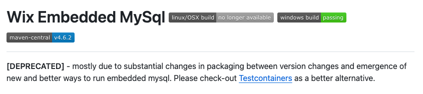
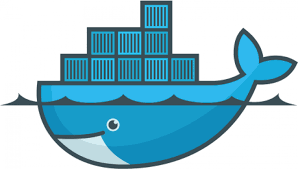
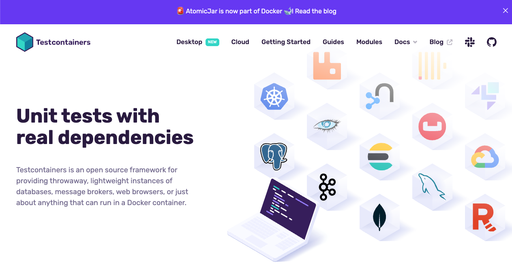
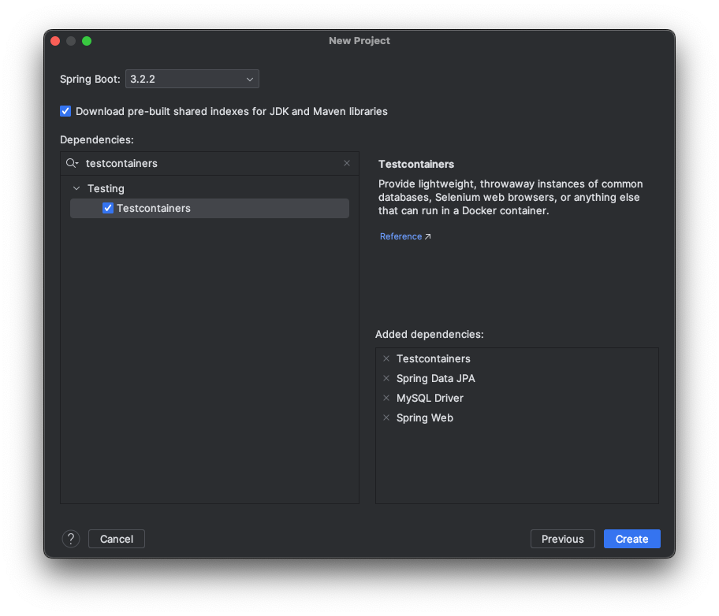
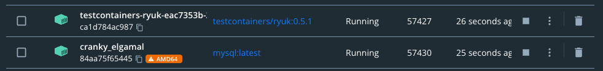
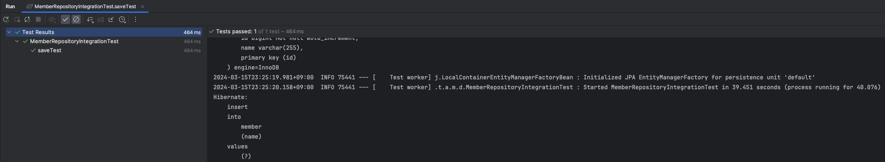

# testcontainers

Spring Boot 환경에서 testcontainers 적용하기 위한 방법을 정리한다.

## testcontainers

대부분의 애플리케이션 서비스는 다른 서비스의 의존성을 가지고 운영된다. 간단한 예시로 데이터 저장을 위한 DB, 소셜 로그인을 위한 서버 호출 등을 통해 유기적으로 이루워져 있다.
즉 하나의 독립적인 서버 환경에서는 원할한 서비스를 운영하는 것은 어려운 일이다.
이러한 외부 의존성들은 애플리케이션 개발에 많은 편의성을 제공해주지만 우리가 제어할 수 없는 영역이 늘어날수록 통합 테스트에 대한 편의성은 줄어든다.

> 통합 테스트란?
>
> 애플리케이션의 모든 구성 요소가 예상대로 작동하는지 확인하는 유형의 테스트이다.

만약 우리가 `RDBMS` 중 하나인 `MySQL`을 활용하여 서비스의 데이터를 관리한다고 가정한다. 통합 테스트를 진행하려면 우리 서비스에 연동된 MySQL에 데이터를 CRUD 할 수 있어야 한다.
이러한 DB 연동 방법에는 여러가지가 있는데 몇 가지 방법을 추려보았다.

### 실제 운영 중인 DB에 직접 접근하여 통합 테스트

실제 운영 중인 서비스에서 달성할 수 있는 가장 간단한 방법이다. 안정적으로 운영 중인 서버로 DB 드라이버를 연동하고 그대로 테스트 코드를 작성하면 된다.
다만 이 방식의 가장 큰 단점은 실제 운영 데이터에 통합 테스트 중 발생한 데이터가 섞이게 되는 것이다.
또한 테스트는 여러 번 수행 되더라도 동일한 결과를 보여줘야 하기 때문에 `멱등성`을 잘 지키는 것이 중요하다.

> 멱등성
>
> 수학이나 전산학에서 연산의 한 성질을 나타내는 것으로, 연산을 여러 번 적용하더라도 결과가 달라지지 않는 성질

이 멱등성을 지키기 위해서는 테스트 중 변경된 사항을 찾아 테스트 이전 상태로 바꿔줘야 한다. 이 작업은 DB 모델링에 따라 매우 복잡한 작업이 될 수 있다.
또한 운영 중인 서비스 데이터에 직접적인 영향이 생길 수 있기 때문에 추천하지 않는 방법이다.

### 임베디드 형태의 DB 활용

일부 DB는 임베디드 형태의 테스트를 제공하기도 한다.

* [h2database](https://github.com/h2database/h2database)
* [wix-embedded-mysql](https://github.com/wix-incubator/wix-embedded-mysql)

이러한 임베디드 형태의 DB는 스프링 서버와 라이프 사이클을 공유하기 때문에 `멱등성`을 지키기가 쉽다. 단순히 테스트를 진행할 때마다 DB 안에 모든 데이터를 초기화하면 되기 때문이다.
또한 여러 명이서 한 프로젝트를 진행할 경우 추가적인 설정 없이 바로 서버 실행 및 테스트가 가능 하다는 장점이 있다.

하지만 임베디드 형태의 DB의 경우 DB의 버전 변경에 적절히 대응해야 하지만 실제 DB 서버와는 차이가 있기 때문에 한계가 존재한다.
실제 서비스에서 운영 중인 DB와 버전, 동작 방식이 다를 수 있기 때문에 실제와 유사한 환경에서 테스트하는데 한계가 있다.
같은 결과가 나오길 기대 했지만 내부 동작 방식에 대한 차이로 인해 서로 다른 결과가 나올 가능성이 있기 때문이다.
[wix-embedded-mysql](https://github.com/wix-incubator/wix-embedded-mysql) 문서를 살펴보면 지원이 중단된 것을 확인할 수 있다.



### 로컬에서 동일 버전 DB 설치

다음은 로컬 환경에 운영 중인 DB 서버와 동일한 버전을 설치해서 연동하는 것이다. 서버를 직접 설치도 가능하고 도커와 같은 컨테이너 기술을 통해 실행하는 것도 가능하다.
이 방식의 가장 큰 장점은 실제 운영 DB 서버와 동일한 환경에서 테스트할 수 있다는 것이다. 또한 로컬에서 수행되기 때문에 DB 테이블에 대한 조작을 자유롭게 할 수 있다.

하지만 이에 대한 단점은 해당 프로젝트를 개발하는 모든 팀원이 개별적으로 설치하고 관리해야 한다는 것이다. 그나마 도커 컨테이너를 사용하면 도커 이미지를 통해 이러한 단점을 어느정도 상쇄시킬 수 있다.



### testcontainers 활용한 통합 테스트 환경 구성

[testcontainers](https://testcontainers.com/)는 테스트 환경을 도커 컨테이너로 제공하는 라이브러리이다. 데이터베이스, 웹 서버, 카프카 등
다양한 종류의 컨테이너를 코드 레벨에서 제공해준다. 이러한 컨테이너는 테스트를 실행하는 동안 초기화되고, 완료되면 자동으로 제거된다.
즉 테스트 진행과 동일한 라이프사이클을 가지고 동작한다. 이를 통해 테스트 환경의 일관성을 유지하여 멱등성을 잘 지킬 수 있도록 도와준다.



간단한 예시 작성을 위해 아래와 같은 환경에서 진행하였다.

* Spring Boot 3.2.2
* Java 17
* Testcontainers
* Spring Data JPA
* MySQL Driver
* Spring Web



아래는 프로젝트 생성 이후 `build.gradle.kts` 파일을 가져온 것이다.

```kotlin
import org.jetbrains.kotlin.gradle.tasks.KotlinCompile

plugins {
    id("org.springframework.boot") version "3.2.2"
    id("io.spring.dependency-management") version "1.1.4"
    kotlin("jvm") version "1.9.22"
    kotlin("plugin.spring") version "1.9.22"
    kotlin("plugin.jpa") version "1.9.22"
}

group = "c.hyeoni"
version = "0.0.1-SNAPSHOT"

java {
    sourceCompatibility = JavaVersion.VERSION_17
}

repositories {
    mavenCentral()
}

dependencies {
    implementation("org.springframework.boot:spring-boot-starter-data-jpa")
    implementation("org.springframework.boot:spring-boot-starter-web")
    implementation("com.fasterxml.jackson.module:jackson-module-kotlin")
    implementation("org.jetbrains.kotlin:kotlin-reflect")

    runtimeOnly("com.mysql:mysql-connector-j")

    testImplementation("org.springframework.boot:spring-boot-starter-test")
    testImplementation("org.springframework.boot:spring-boot-testcontainers")
    testImplementation("org.testcontainers:mysql")
    testImplementation("org.testcontainers:junit-jupiter")
}

tasks.withType<KotlinCompile> {
    kotlinOptions {
        freeCompilerArgs += "-Xjsr305=strict"
        jvmTarget = "17"
    }
}

allOpen {
    annotation("jakarta.persistence.Entity")
    annotation("jakarta.persistence.Embeddable")
    annotation("jakarta.persistence.MappedSuperclass")
}

tasks.withType<Test> {
    useJUnitPlatform()
}
```

`Spring Boot`에서 `testcontainers`의 대한 지속적인 지원으로 편리하게 의존성을 추가하여 진행할 수 있다.
특히 `Spring Boot 3.1` 이후 버전 부터는 `testcontainers`에 대한 지원이 더욱 향상되어 간단한 애노테이션 추가만으로 서버 구성이 가능해졌다.

이제 통합 테스트를 진행하기 위해 MySQL 서버에 대한 세팅을 진행한다.

```kotlin
@ActiveProfiles("testcontainers")
@TestConfiguration(proxyBeanMethods = false)
class ContainersConfig {

    @Bean
    @ServiceConnection
    fun mysqlContainer(): MySQLContainer<*> {
        return MySQLContainer(DockerImageName.parse("mysql:latest"))
            .withDatabaseName("test-example")
            .withUsername("test")
            .withPassword("test")
            .withReuse(true)
    }
}

fun main(args: Array<String>) {
    fromApplication<TestcontainersApplication>()
        .with(ContainersConfig::class)
        .run(*args)
}
```

이제 익숙하지 않은 몇 가지 설정을 살펴본다.

* `@ActiveProfiles("testcontainers")`: `testcontainers`와 관련된 설정을 모아두기 위해 `profile`을 분리하여 지정하였다.
* `@ServiceConnection`: 해당 설정을 통해 `@Bean` 메서드에 컨테이너에서 실행 중인 서비스에 대한 연결을 자동으로 설정하도록 도와준다. 해당 애노테이션 덕분에 더욱 편리하게 설정이 가능해졌다.
* `MySQLContainer`: 도커 이미지를 활용하여 `MySQL`을 손쉽게 조작하기 위한 용도이다. DB 접근을 위한 다양한 설정 정보를 기입할 수 있다.

참고로 `testcontainers profile` 설정 정보는 아래와 같다.

```yaml
spring:
  config:
    activate:
      on-profile: testcontainers

  jpa:
    open-in-view: false
    hibernate:
      ddl-auto: create-drop
    properties:
      hibernate:
        format_sql: true
    show-sql: true
```

이제 테스트를 위한 준비는 모두 마무리 되었다. 간단하게 해당 컨테이너를 활용하여 통합 테스트를 작성해본다.

아래는 특정 멤버를 관리하기 위한 `Member Entity`이다. 간단한 검증을 위해 `id`, `name` 프로퍼티만을 가지고 있다.

```kotlin
@Entity
class Member(
    @Id
    @GeneratedValue(strategy = GenerationType.IDENTITY)
    var id: Long = 0L,
    var name: String
)
```

```kotlin
interface MemberRepository : JpaRepository<Member, Long>
```

`@DataJpaTest`를 활용하여 `Repository`에 대한 슬라이스 테스트를 진행한다. 간단히 `member`를 생성해본다.

```kotlin
@DataJpaTest
@AutoConfigureTestDatabase(replace = AutoConfigureTestDatabase.Replace.NONE)
@Import(ContainersConfig::class)
@ActiveProfiles("testcontainers")
class MemberRepositoryIntegrationTest {

    @Autowired
    private lateinit var memberRepository: MemberRepository

    @Test
    fun saveTest() {
        val member = Member(name = "hyeonic")

        assertThatCode { memberRepository.save(member) }.doesNotThrowAnyException()
    }
}
```

* `@DataJpaTest`: JPA와 관련된 요소만 빈으로 등록한다.
* `@AutoConfigureTestDatabase(replace = AutoConfigureTestDatabase.Replace.NONE)`: `@DataJpaTest`를 사용하면 별도 설정 없이 자체적으로
  생성된 임베디드 DB를 활용한다. 하지만 우리는 실제 도커 컨테이너에서 동작하는 MySQL에 접근하여 테스트해야 하므로 해당 설정을 변경한다.
* `@Import(ContainersConfig::class)`: 별도 설정한 `Config`를 import한다. 앞서 언급한 것 처럼 `@DataJpaTest`는 JPA와 관련된 EntityManager,
  Repository 등만 빈 등록 대상으로 활용한다.
* `@ActiveProfiles("testcontainers")`: 앞서 작성한 `application-testcontainers.yml`에 명시한 설정을 사용하기 위한 목적이다.

`testcontainers`는 도커 컨테이너를 활용하여 테스트 환경을 구성한다. `도커 데스크탑`을 활용하여 `testcontainers`가 어떻게 MySQL 컨테이너를 활용하는지 확인해본다.



요상한 이름을 가진 두 개의 컨테이너가 자동으로 실행된 것을 확인할 수 있다. `mysql:latest`는 MySQL 컨테이너인 것을 알겠는데 `testcontainers/ryuk`은 무엇일까?

`ryuk`의 주요 역할은 테스트가 완료된 후에 사용된 모든 리소스를 자동으로 정리한다. `ryuk`는 `testcontainers`가 시작될 때 함께 실행되며(예시에서는 테스트가 수행될
때), `testcontainers`와 함께 생성된 모든 것들을 관리한다. 테스트 종료되면, `ryuk`는 해당 정보를 바탕으로 생성된 모든 리소스를 안전하게 정리하고 삭제한다.

테스트가 완료된 후 도커 데스크탑을 확인해보면 깔끔하게 정리된 것을 확인할 수 있을 것이다. 물론 테스트도 성공한다!



## 마무리

지금까지 `testcontainers`를 활용하여 통합 테스트 환경을 구축하는 방법에 대해 알아보았다. 해당 기술을 활용하면 실제 운영 중인 데이터베이스에 접근하지 않고도, 업데이트가 원할하게 되지 않는 임베디드
데이터베이스를 활용하기 않고도 운영 환경과 동일하게 세팅하여 멱등성을 지키며 원할하게 테스트를 진행할 수 있다. 데이터베이스 뿐만 아니라 실제 연동하고 있는 웹 서버, 카프카 등에 대한 테스트도 도커 컨테이너를
활용하여 별다른 서버 세팅 없이 편리하게 진행할 수 있다.

다만 도커 컨테이너를 활용할 수 없는 제한적인 환경이거나 도커 레지스트리에 접근이 제한되는 환경인 경우 이미지를 원할하게 사용하지 못할 수 있다. 결국 사용하고자 하는 이미지가 접근 가능한 형태로 제공 되어야 한다는
것이다. 이러한 부분은 도커라는 의존성을 활용한 테스트임을 인지하여야 한다.

## References.

* [멱등법칙](https://ko.wikipedia.org/wiki/%EB%A9%B1%EB%93%B1%EB%B2%95%EC%B9%99)
* [improved-testcontainers-support-in-spring-boot-3-1](https://spring.io/blog/2023/06/23/improved-testcontainers-support-in-spring-boot-3-1)
