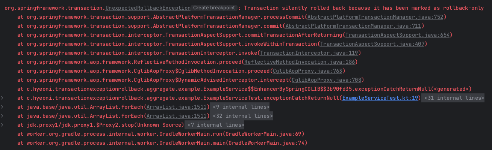

# transaction-exception-rollback

`kotlin`에서 `arrow.io`에서 제공하는 라이브러리를 사용하면 부족한 함수형 패러다임을 적절하게 적용할 수 있다. 
함수형 프로그래밍을 진행할 때 발생할 수 있는 부수 효과를 인지하고 적절히 제어하는 것이 중요하다. 
하지만 스프링 프레임워크와 같이 우리에게 편리한 기능을 제공해주지만 함수형에 대한 개념은 고려하지 않기 때문에 내부 코드에는 다양한 부수 효과(예외를 던지는 등)가 존재하고 있다.
비즈니스 로직에서 함수형 패러다임을 적절히 적용하기 위해서는 이러한 부수 효과를 제어하기 위한 장치를 마련해야 한다. 
지금 부터 이러한 부수 효과 제어를 위해 적용 했던 기법을 활용하던 중 기존 프레임워크의 방향성과 충돌하며 직면한 문제 상황을 재연한 뒤 개선 방법에 대해 고민해보려 한다.

## 트랜잭션 안에서 예외 가두기

우선 아래와 같은 예제 코드가 있다고 가정한다.

```kotlin
@Repository
class ExampleRepository {

    @Transactional(readOnly = true)
    fun throwException() {
        throw IllegalArgumentException()
    }
}
```

```kotlin
@Service
class ExampleService(
    private val ExampleRepository: ExampleRepository
) {

    @Transactional(readOnly = true)
    fun exceptionCatchReturnNull() {
        runCatching { ExampleRepository.throwException() }
            .onSuccess { println("success") }
            .onFailure { println("failure") }
            .getOrNull()
    }
}
```

예제를 간단히 설명하면 ExampleRepository에서 던지는 예외를 `runCatching`을 활용하여 `Result`로 감싼 뒤 `getOrNull`을 통해 변환한다.
즉 ExampleRepository가 던진 예외를 전파 시키지 않고 가두게 된다.

위 예제 코드를 수행하는 테스트 코드를 작성해본다.

```kotlin
@SpringBootTest
class ExampleServiceTest @Autowired private constructor(
    private val ExampleService: ExampleService
) {

    @Test
    fun exceptionCatchReturnNull() {
        ExampleService.exceptionCatchReturnNull()
    }
}
```

코드는 매우 심플하다. 단순히 `ExampleService.exceptionCatchReturnNull()`을 수행하고 있다. 결과는 아래와 같다.



분명 예외를 가두었기 때문에 테스트가 성공하길 기대했지만 결과는 롤백 마킹으로 인해 트랜잭션이 롤백된다.

## ExampleRepository.throwException()에서 예외 발생

먼저 `ExampleRepository`의 `throwException()`에서 예외가 발생하면 어떠한 일이 발생하는지 디버깅을 진행하며 코드를 따라가본다.

```java
package org.springframework.transaction.interceptor;

// ...

public abstract class TransactionAspectSupport implements BeanFactoryAware, InitializingBean {
    // ...
    @Nullable
    protected Object invokeWithinTransaction(Method method, @Nullable Class<?> targetClass,
                                             final InvocationCallback invocation) throws Throwable {
        // ...
        if (txAttr == null || !(ptm instanceof CallbackPreferringPlatformTransactionManager)) {
            // ...
            Object retVal;
            try {
                // This is an around advice: Invoke the next interceptor in the chain.
                // This will normally result in a target object being invoked.
                retVal = invocation.proceedWithInvocation();
            }
            catch (Throwable ex) {
                // target invocation exception
                completeTransactionAfterThrowing(txInfo, ex);
                throw ex;
            }
            finally {
                cleanupTransactionInfo(txInfo);
            }
            // ...
        }
        // ...
    }
    // ...
}
```

`TransactionAspectSupport`는 트랜잭션 관리를 위해 다양한 기능을 지원한다. 
특정 메서드에 `@Transactional` 애노테이션이 존재 한다면 프록시 객체가 `TransactionAspectSupport`의 `invokeWithinTransaction` 메서드를 호출하여
실제 비즈니스 로직이 담긴 메서드(`ExampleRepository`의 `throwException()`)를 호출한다.

정리하면 `invocation.proceedWithInvocation()`에서 실제 `ExampleRepository`의 `throwException()`을 호출 한다고 볼 수 있다.
결국 해당 로직에서 예외가 발생하기 때문에 catch 구문에서 `completeTransactionAfterThrowing(txInfo, ex)`을 수행하게 된다.

```java
package org.springframework.transaction.interceptor;

// ...

public abstract class TransactionAspectSupport implements BeanFactoryAware, InitializingBean {
    // ...
    protected void completeTransactionAfterThrowing(@Nullable TransactionInfo txInfo, Throwable ex) {
        if (txInfo != null && txInfo.getTransactionStatus() != null) {
            // ...
            if (txInfo.transactionAttribute != null && txInfo.transactionAttribute.rollbackOn(ex)) {
                try {
                    txInfo.getTransactionManager().rollback(txInfo.getTransactionStatus());
                }
                catch (TransactionSystemException ex2) {
                    logger.error("Application exception overridden by rollback exception", ex);
                    ex2.initApplicationException(ex);
                    throw ex2;
                }
                catch (RuntimeException | Error ex2) {
                    logger.error("Application exception overridden by rollback exception", ex);
                    throw ex2;
                }
            }
            // ...
    }
    // ...
}
```

`completeTransactionAfterThrowing()`는 예외가 발생하면 롤백 처리를 수행하기 위한 메서드이다. 
다양한 조건을 거쳐 rollback을 수행하게 되는데 몇 가지 짚고 넘어갈 부분을 살펴보았다.

```java
package org.springframework.transaction.interceptor;

// ...

public class DefaultTransactionAttribute extends DefaultTransactionDefinition implements TransactionAttribute {
    // ...
    @Override
    public boolean rollbackOn(Throwable ex) {
        return (ex instanceof RuntimeException || ex instanceof Error);
    }
    // ...
}
```

`txInfo.transactionAttribute.rollbackOn(ex)`는 `RuntimException(uncheckedException)`이거나 `Error`의 경우에 `true`를 반환한다.
`ExampleRepository.throwException()`에서는 `uncheckedException`을 던지기 때문에 해당 조건을 만족한 뒤 `txInfo.getTransactionManager().rollback(txInfo.getTransactionStatus())`를 통해 `rollback`을 수행한다.

이제 실제로 롤백이 어떤식으로 이루어지는지 살펴본다.

```java
package org.springframework.transaction.support;

// ...

public abstract class AbstractPlatformTransactionManager implements PlatformTransactionManager, Serializable {
    // ...

    @Override
    public final void rollback(TransactionStatus status) throws TransactionException {
        // ...
        DefaultTransactionStatus defStatus = (DefaultTransactionStatus) status;
        processRollback(defStatus, false);
    }

    private void processRollback(DefaultTransactionStatus status, boolean unexpected) {
        try {
            boolean unexpectedRollback = unexpected;

            try {
                // ,,,
                if (status.hasSavepoint()) {
                    // ...
                } else if (status.isNewTransaction()) {
                    // ...
                    doRollback(status);
                } else {
                    // Participating in larger transaction
                    if (status.hasTransaction()) {
                        if (status.isLocalRollbackOnly() || isGlobalRollbackOnParticipationFailure()) {
                            // ...
                            doSetRollbackOnly(status);
                        }
                        else { 
                            // ... 
                        }
                    }
                    else {
                        // ...
                    }
                    // ...
                }
            }
            catch (RuntimeException | Error ex) {
                // ...
            }
            // ...
        }
        // ...
    }
    
    // ...
}
```

`rollback()`을 호출하면 `processRollback()`에서 `isNewTransaction()`를 통해 실제 DB에서 롤백을 진행할지 롤백 마킹할지 판단한다.

`ExampleRepository.throwException()`의 경우 `ExampleService.exceptionCatchReturnNull()`를 통해 호출되고 있다.
`exceptionCatchReturnNull()`또한 `@Transactional` 애노테이션을 가지고 있기 때문에 `ExampleRepository.throwException()`는 논리적인 내부 트랜잭션을 가지게 된다.

그렇기 때문에 실제 물리적인 트랜잭션을 롤백하지 않고 `doSetRollbackOnly(status)` 트랜잭션 매니저에 `롤백 마킹`을 진행한다.

이제 간단히 정리해보자.
 * `ExampleRepository.throwException()`을 호출하면 `@Transactional` 애노테이션으로 인해 프록시 객체가 비즈니스 메서드(`ExampleRepository.throwException()`)를 대신 호출한다.
 * 호출 중 예외가 발생하면 `Throwable`의 타입을 확인한 뒤 롤백을 진행한다. (기본적으로 `UncheckedException`, `Error` 타입만 롤백)
 * 해당 트랜잭션이 `newTransaction`인지 `hasTransaction`인지 확인한 뒤 실제 물리적인 롤백을 진행하거나 롤백 마킹을 진행한다. (newTransaction인 경우 최초 호출된 논리적인 트랜잭션이기 때문에 `물리적인 롤백`)
 * `ExampleRepository.throwException()`의 경우 `ExampleService.exceptionCatchReturnNull()`를 통해 호출되었기 때문에 롤백 마킹을 진행한다.

## UnexpectedRollbackException의 발생지

`ExampleRepository.throwException()`을 호출하면 비즈니스 로직 중 발생한 예외를 감지하고 롤백 마킹을 진행한다. 이제 해당 메서드를 호출한 호출부의 로직을 따라가본다.

```kotlin
@Service
class ExampleService(
    private val exampleRepository: ExampleRepository
) {
    // ...
    @Transactional(readOnly = true)
    fun exceptionCatchReturnNull() {
        runCatching { exampleRepository.throwException() }
            .onSuccess { println("success") }
            .onFailure { println("failure") }
            .getOrNull()
    }
    // ...
}
```

`ExampleService.exceptionCatchReturnNull()`도 `ExampleRepository.throwException()`과 동일하게 `@Transactional` 애노테이션이 존재하므로 프록시 객체를 통해 비즈니스 메서드를 수행한다.

```java
package org.springframework.transaction.interceptor;

// ...

public abstract class TransactionAspectSupport implements BeanFactoryAware, InitializingBean {
    // ...
    @Nullable
    protected Object invokeWithinTransaction(Method method, @Nullable Class<?> targetClass,
                                             final InvocationCallback invocation) throws Throwable {
        // ...
        if (txAttr == null || !(ptm instanceof CallbackPreferringPlatformTransactionManager)) {
            // ...
            Object retVal;
            try {
                // ...
                retVal = invocation.proceedWithInvocation();
            }
            catch (Throwable ex) {
                completeTransactionAfterThrowing(txInfo, ex);
                throw ex;
            }
            // ...
            commitTransactionAfterReturning(txInfo);
            return retVal;
        }
    }
    // ...        
}
```

한 가지 다른점이 있다면 `invocation.proceedWithInvocation()` 호출 시 비즈니스 로직에서 예외를 던지지 않기 때문에 바로 `commitTransactionAfterReturning(txInfo)`을 호출한다.

```java
package org.springframework.transaction.interceptor;

// ...

public abstract class TransactionAspectSupport implements BeanFactoryAware, InitializingBean {
    // ...

    protected void commitTransactionAfterReturning(@Nullable TransactionInfo txInfo) {
        if (txInfo != null && txInfo.getTransactionStatus() != null) {
            // ...
            txInfo.getTransactionManager().commit(txInfo.getTransactionStatus());
        }
    }
    
    // ...
}
```

`commitTransactionAfterReturning()`은 트랜잭션 매니저를 활용하여 현재 트랜잭션 상태를 기반으로 `commit`을 진행한다.

```java
package org.springframework.transaction.support;

// ...

public abstract class AbstractPlatformTransactionManager implements PlatformTransactionManager, Serializable {
    // ...

    @Override
    public final void commit(TransactionStatus status) throws TransactionException {
        // ...
        processCommit(defStatus);
    }

    private void processCommit(DefaultTransactionStatus status) throws TransactionException {
        try {
            boolean beforeCompletionInvoked = false;

            try {
                boolean unexpectedRollback = false;
                // ...
                beforeCompletionInvoked = true;

                if (status.hasSavepoint()) {
                    // ...
                } else if (status.isNewTransaction()) {
                    // ...
                    unexpectedRollback = status.isGlobalRollbackOnly();
                    doCommit(status);
                }
                // ...
            }
            // ...
        }
    }
    // ...
}
```

`ExampleService.exceptionCatchReturnNull()`는 앞서 언급한 것 처럼 트랜잭션의 진입점이다. `newTransaction`이기 때문에 실제 물리적인 commit을 위해 `doCommit()`을 호출한다.

```java
package org.springframework.orm.jpa;

// ...
public class JpaTransactionManager extends AbstractPlatformTransactionManager
        implements ResourceTransactionManager, BeanFactoryAware, InitializingBean {
    // ...

    @Override
    protected void doCommit(DefaultTransactionStatus status) {
        JpaTransactionObject txObject = (JpaTransactionObject) status.getTransaction();
        // ...
        try {
            EntityTransaction tx = txObject.getEntityManagerHolder().getEntityManager().getTransaction();
            tx.commit();
        }
        catch (RollbackException ex) {
            // ...
        }
        // ...
    }
    
    // ...
}
```

위 로직에서 물리적인 트랜잭션을 획득한 뒤 `tx.commit()`한다. 

```java
package org.hibernate.resource.transaction.backend.jdbc.internal;

// ...

public class JdbcResourceLocalTransactionCoordinatorImpl implements TransactionCoordinator {
    // ...

    @Override
    public void commit() {
        try {
            if ( rollbackOnly ) {
                // ...
                try {
                    rollback();
                    // ...
                    return;
                }
                // ...
            }
        }
        // ...
    }
    // ...
}
```

코드를 쭉 따라가다보면 `rollbackOnly` 체크하는 부분이 있다. 
우리는 과거에 `ExampleRepository.throwException()`을 호출할 때 던진 예외를 기반으로 롤백 마킹한 것을 기억해야 한다. 
해당 과정에서 `rollbackOnly = true`로 변경되기 때문에 try 구문 안에 `rollback()`을 호출하여 물리적인 롤백을 진행한다.

자 이제 다 왔다. 실제 `UnexpectedRollbackException`을 던지는 부분을 확인해본다.

```java
package org.springframework.transaction.support;

// ...

public abstract class AbstractPlatformTransactionManager implements PlatformTransactionManager, Serializable {
    // ...

    @Override
    public final void commit(TransactionStatus status) throws TransactionException {
        // ...
        processCommit(defStatus);
    }

    private void processCommit(DefaultTransactionStatus status) throws TransactionException {
        try {
            boolean beforeCompletionInvoked = false;

            try {
                boolean unexpectedRollback = false;
                // ...
                beforeCompletionInvoked = true;

                if (status.hasSavepoint()) {
                    // ...
                } else if (status.isNewTransaction()) {
                    // ...
                    unexpectedRollback = status.isGlobalRollbackOnly();
                    doCommit(status);
                }
                // ...

                if (unexpectedRollback) {
                    throw new UnexpectedRollbackException(
                            "Transaction silently rolled back because it has been marked as rollback-only");
                }
            } catch (UnexpectedRollbackException ex) {
                triggerAfterCompletion(status, TransactionSynchronization.STATUS_ROLLED_BACK);
                throw ex;
            }
            // ...
        }
    }
    // ...
}
```

`unexpectedRollback = status.isGlobalRollbackOnly()`에서 이미 롤백 마킹을 확인하여 예기치 않은 롤백 여부를 판단하고 있다. 
실제 롤백이 수행 되는 부분은 `doCommit()`부터 시작 되는 것을 확인할 수 있었다.

이제 `unexpectedRollback` 여부를 확인하여 최종적으로 `UnexpectedRollbackException`을 던지게 된다. 던져진 예외는 프록시 객체를 통해 우리에게 전달된다.

정리하면 아래와 같다.
 * `ExampleService.exceptionCatchReturnNull()`는 최초 트랜잭션의 진입점이다. newTransaction이기 때문에 물리적으로 커밋되거나 롤백된다.
 * `ExampleService.exceptionCatchReturnNull()` 수행 중 내부에서 발생한 예외를 전파하지 않고 제어 하더라도 내부에서 논리적으로 분리된 트랜잭션에서 예외를 한번이라도 throw 했다면(`ExampleRepository.throwException()`) 롤백 마킹을 진행한다.
 * 롤백 마킹된 트랜잭션은 아무리 예외를 가두고 전파하지 않아도 최종적으로 물리적인 커밋을 진행하는 시점에 롤백 마킹을 확인하여 롤백한다.
